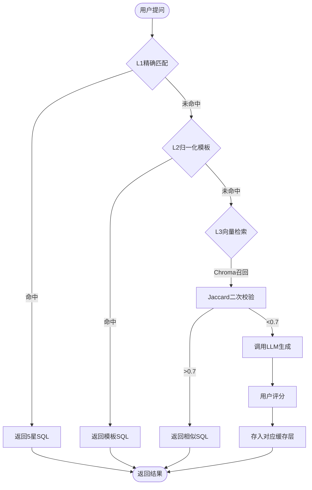
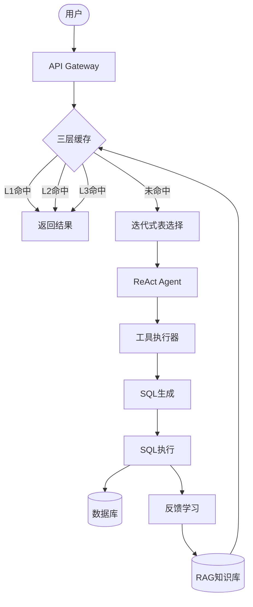
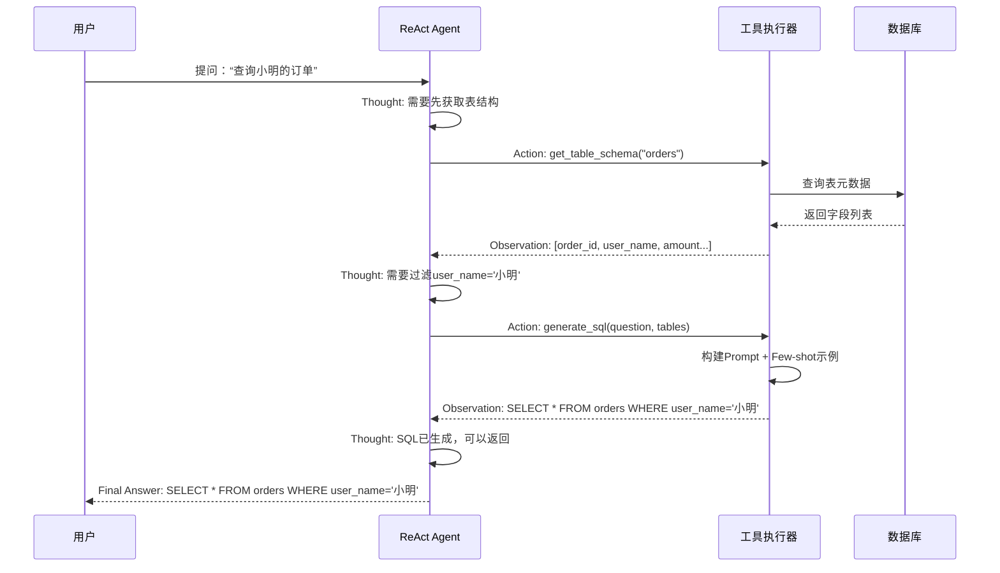

# 通用NL2SQL Agent为什么不行？我们踩了Ollama、Tool Calling、Prompt爆炸的坑后，终于落地了"通用底座+垂直SPI"架构（附核心实现代码）

> **摘要**：本文记录了一个NL2SQL系统从"通用Agent"理想到"垂直领域底座"现实的完整演进过程。**核心结论：通用NL2SQL Agent的失败，本质是通用自然语言与垂直业务语义的天然割裂**——人类口语的泛化性与数据库的行业私有化语义无法直接匹配。经历了API选型错误（/api/generate vs /api/chat）、Tool Calling幻觉、Prompt爆炸、三层缓存架构设计、RAG调优等一系列技术坑，最终通过"通用底座+行业SPI扩展"架构找到平衡点。**包含Ollama Tool Calling真实调用代码、三层缓存实现、SQL评分算法等可运行代码片段**。文章深入分析了通用Agent的技术边界，以及为何"适度约束"反而能提升系统可用性。

---

## 📋 技术选型清单（2026年4月版）

| 组件 | 技术选型 | 版本 | 备注 |
|------|---------|------|------|
| LLM推理 | Ollama + Qwen3:8b + Qwen2.5-Coder:7b | 最新版 | 双模型架构，开启Tool Calling |
| Embedding | BAAI/bge-m3 | - | 多语言支持，1024维 |
| 向量库 | Chroma | 最新版 | 持久化模式，余弦相似度 |
| 缓存 | Redis + Caffeine | 6.x + 3.x | L1本地缓存+L2分布式 |
| 数据库连接 | HikariCP + MySQL | 5.1.0 + 8.0 | 只读账户 |
| Agent框架 | 自研ReAct + LangChain4j | 1.12.2 | 仅使用其Tool Spec |
| SQL解析 | JSqlParser | 4.6 | AST解析 |
| 评分工具 | 自研Exact Set Match | - | 基于Spider标准 |
| Groovy脚本 | Groovy | 4.x | Skill热插拔 |

---

## 🎯 初心：一个通用Agent的梦想

最初的目标很纯粹：**构建一个真正的通用NL2SQL Agent**。

设计理念：
```
用户自然语言 → [通用Agent] → SQL
                    ↓
            拉取任意行业表结构
            (直连数据库 / DDL导入)
```

### 理想中的架构

```java
// 伪代码：理想的通用Agent
public class UniversalAgent {
    
    public String generateSQL(String naturalLanguage, DataSource ds) {
        // 1. 自动推断表结构
        TableMetadata metadata = extractMetadata(ds);
        
        // 2. 自动发现表关联
        List<Relationship> relationships = inferRelationships(metadata);
        
        // 3. LLM生成SQL
        return llm.generate(naturalLanguage, metadata, relationships);
    }
}
```

**核心假设**：只要表元数据足够精准（字段注释、表关联关系），LLM就能理解业务语义，生成正确SQL。

---

## 💥 现实打击：为什么通用Agent走不通？

### 【新增】核心根因：通用自然语言 vs 垂直业务语义的天然割裂

这是所有问题的底层逻辑，也是通用Agent必死的本质原因：

| 维度 | 人类日常自然语言 | 企业数据库业务语义 |
|------|------------------|--------------------|
| 表达特征 | 泛化、模糊、口语化、无约束 | 精准、私有化、强口径、行业黑话 |
| 核心属性 | 通用性（同一词可指不同事物） | 唯一性（同一字段/指标有固定口径） |
| 依赖背景 | 上下文依赖强 | 业务规则依赖强 |
| 示例 | "销售额"可能指订单金额、支付金额、回款金额 | 电商库"销售额" = SUM(order_items.quantity * order_items.unit_price)，且不含退款 |

**直接后果**：
- LLM无法仅凭表结构注释，理解"销售额"在电商行业的具体口径
- 同一自然语言表达，在不同行业对应完全不同的SQL逻辑
- 缺少中间层：**通用语言 → 行业术语 → 数据库字段**的映射

---

### 坑1：自然语言的随意性 vs 业务语义的确定性需求

**问题场景**：
```
用户输入1: "查询小明的订单"
用户输入2: "查下小明都买了啥"  
用户输入3: "看看小明最近的购买记录"

期望输出: SELECT * FROM orders WHERE user_name = '小明'
实际输出: 3种完全不同的SQL结构
```

**根本原因**（补充本质）：
- **表层**：自然语言表达千变万化
- **深层**：缺少"通用语言 → 行业术语 → 数据库字段"的映射层
- **技术层**：LLM对同一语义可能生成不同SQL结构

---

### 坑2：多数据源选择灾难

**真实案例**：
```yaml
数据源列表:
  - ecommerce_db (电商库: orders, users, products)
  - finance_db (财务库: invoices, payments)
  - hr_db (人力库: employees, departments)

用户问: "查询销售额"
LLM选择: hr_db ❌ (完全错误)
```

**原因分析**（补全本质）：
- **核心**：LLM无法理解"销售额"是电商行业的专属术语（语义层缺失）
- **表层**：表名`orders`在不同库可能有不同含义
- **底层**：缺少行业语义引导，通用Agent无法区分"行业黑话"对应的领域

---

### 坑3：Tool Calling的艰难之路

#### 阶段1：伪Tool Calling（Pipeline模式）

```java
// 错误示范：硬编码调用
public class ReActAgent {
    
    public String execute(String query) {
        // 第1步：强制调用工具1
        String tables = callTool("get_tables", query);
        
        // 第2步：强制调用工具2  
        String sql = callTool("generate_sql", query, tables);
        
        return sql; // 这不是Agent，这是Pipeline！
    }
}
```

**问题**：LLM没有真正决策权，只是按固定流程执行。

---

#### 阶段2：API选型错误（0级坑）

**致命错误**：使用了错误的Ollama API端点

```java
// ❌ 错误：/api/generate 不支持 Tool Calling
POST /api/generate
{
  "model": "qwen3:8b",
  "prompt": "..."
}

// ✅ 正确：/api/chat 才支持原生 Tool Calling
POST /api/chat
{
  "model": "qwen3:8b",
  "messages": [...],
  "tools": [...]  // 工具定义
}
```

**后果**：
- 浪费2周时间调试"为什么LLM不支持Tool Calling"
- 尝试更换多个模型（ChatGLM、Baichuan等）
- 最后发现是API端点选错了

**教训**：**务必仔细阅读官方文档，确认API能力边界**。

---

#### 阶段3：Prompt爆炸

为了让LLM理解工具，不断往System Prompt里加说明：

```java
String systemPrompt = """
你是一个SQL生成助手...

可用工具：
1. get_tables: 获取表列表
   参数：datasourceId
   返回：表名列表
   
2. get_columns: 获取字段信息
   参数：tableName
   返回：字段列表
   
3. generate_sql: 生成SQL
   参数：question, tables
   返回：SQL语句
   
使用示例：
Thought: 我需要先获取表列表
Action: get_tables
Action Input: {"datasourceId": 1}
Observation: ["orders", "users"]

Thought: 现在生成SQL
Action: generate_sql  
Action Input: {"question": "...", "tables": ["orders"]}
Observation: SELECT ...

请严格按照以上格式...
"""; // 超过500行
```

**问题**：
- Prompt过长导致LLM注意力分散
- Token消耗巨大（每次调用~3000 tokens）
- 响应速度慢（平均8-10秒）

---

### 🛠️ 技术突破：Ollama Tool Calling的真实实现

**核心代码**（`OllamaProvider.java`）：

```java
@Service
public class OllamaProvider implements LLMProvider {
    
    private final String baseUrl;
    private final String modelName;
    private final HttpClient httpClient;
    private final ObjectMapper objectMapper;
    
    /**
     * 生成文本并支持原生 Tool Calling
     * @param messages 消息列表
     * @param temperature 温度参数
     * @param tools 工具定义列表（OpenAI 兼容格式）
     * @return Chat API 完整响应（包含 tool_calls）
     */
    public Map<String, Object> generateWithTools(
        List<Map<String, Object>> messages, 
        double temperature, 
        List<Map<String, Object>> tools
    ) {
        try {
            Map<String, Object> requestBody = new HashMap<>();
            requestBody.put("model", modelName);
            requestBody.put("messages", messages);
            requestBody.put("temperature", temperature);
            requestBody.put("stream", false);
            
            // ✅ 禁用 thinking/reasoning 模式，强制直接返回 tool_calls
            requestBody.put("think", false);
            
            if (tools != null && !tools.isEmpty()) {
                requestBody.put("tools", tools);
                log.debug("[OllamaProvider] 启用 Tool Calling，工具数量: {}", tools.size());
            }
            
            String jsonBody = objectMapper.writeValueAsString(requestBody);
            
            HttpRequest request = HttpRequest.newBuilder()
                .uri(URI.create(baseUrl + "/api/chat"))  // ✅ 使用 Chat API
                .header("Content-Type", "application/json")
                .timeout(Duration.ofSeconds(timeout))
                .POST(HttpRequest.BodyPublishers.ofString(jsonBody))
                .build();
            
            HttpResponse<String> response = httpClient.send(request, 
                HttpResponse.BodyHandlers.ofString());
            
            if (response.statusCode() != 200) {
                throw new RuntimeException("Ollama API返回错误: " + response.body());
            }
            
            // 解析完整响应（包含 message.tool_calls）
            Map<String, Object> responseMap = objectMapper.readValue(response.body(), Map.class);
            return responseMap;
            
        } catch (Exception e) {
            log.error("[OllamaProvider] Tool Calling 失败", e);
            throw new RuntimeException("Ollama Tool Calling 失败: " + e.getMessage(), e);
        }
    }
}
```

**关键点**：
- ✅ 必须使用 `/api/chat` 端点（而非 `/api/generate`）
- ✅ `think=false` 禁用思考过程，直接返回工具调用
- ✅ 返回结构包含 `message.tool_calls` 数组

---

#### 阶段4：Skill系统的曲折演进

**初衷**：将复杂工具拆分为可复用的Skill模块

```groovy
// Skill设计：热插拔的Groovy脚本
class StandardQuerySkill {
    
    def execute(Map context) {
        // 1. 表选择
        def tables = toolCall("select_tables", context.question)
        
        // 2. SQL生成
        def sql = toolCall("generate_sql", context.question, tables)
        
        // 3. 执行查询
        def result = toolCall("execute_sql", sql)
        
        return result
    }
}
```

**遇到的坑**：
1. **Groovy直接调用Java Service** → 失去Tool抽象层
2. **Skill内部Pipeline化** → 又回到硬编码老路
3. **热加载复杂性** → Groovy类加载器内存泄漏

**妥协方案**：半Skill架构
- Skill作为流程编排器
- 原子操作仍通过Tool Calling
- 保留部分硬编码逻辑（待重构）

---

## 🛠️ 技术突破：三层缓存架构

为了解决LLM幻觉导致的"同问不同答"问题，设计了三级缓存：

### L1：精确匹配缓存（Redis MD5哈希）

```java
// 缓存键：SQL语义的MD5哈希
String cacheKey = md5(normalize(question));

// 检查缓存
CachedResult cached = redis.get(cacheKey);
if (cached != null && cached.rating == 5) {
    return cached.sql; // 直接返回5星SQL
}
```

**效果**：完全相同的提问100%返回相同SQL

---

### L2：归一化模板匹配（规则引擎）

**目标**：识别语义结构一致的查询

```
"今天小明的订单"  → 模板: {时间} {人名} 的订单
"昨天小李的订单"  → 模板: {时间} {人名} 的订单
→ 复用相同SQL结构
```

**实现难点**：
- 正则表达式过于脆弱（少个“的”就失效）
- 尝试用小LLM做语义分解（速度慢且不稳定）
- **当前方案**：硬编码常见模式 + 简单分词

---

#### L2归一化核心实现（`QueryStructureExtractor.java`）

```java
@Slf4j
public class QueryStructureExtractor {
    
    /**
     * 提取查询结构（用于L2缓存归一化）
     */
    public QueryStructure extract(String query) {
        QueryStructure structure = new QueryStructure();
        
        // 1. 提取人名（HanLP NER）
        structure.setPerson(extractPerson(query));
        
        // 2. 提取时间（区分相对/绝对）
        structure.setTime(extractTime(query));
        
        // 3. 提取地点（HanLP NER）
        structure.setLocation(extractLocation(query));
        
        // 4. 提取意图
        structure.setIntent(detectIntent(query));
        
        // 5. 提取时间粒度（每天/每周/每月）
        structure.setTimeGranularity(extractTimeGranularity(query));
        
        // 6. 提取目标关键词（支持行业扩展）
        structure.setTarget(extractTarget(query));
        
        return structure;
    }
    
    /**
     * 时间表达式提取（核心规则引擎）
     */
    private TimeExpression extractTime(String query) {
        // 匹配绝对日期 - 完整格式
        Pattern absoluteDatePattern = Pattern.compile("\\d{4}[-/年]\\d{1,2}[-/月]\\d{1,2}[日]?");
        Matcher matcher = absoluteDatePattern.matcher(query);
        if (matcher.find()) {
            return new TimeExpression("ABSOLUTE", matcher.group());
        }
        
        // 匹配相对时间 - 天级别
        if (query.contains("昨天")) return new TimeExpression("RELATIVE", "昨天");
        if (query.contains("今天")) return new TimeExpression("RELATIVE", "今天");
        
        // 周级别
        if (query.contains("上周")) return new TimeExpression("RELATIVE_WEEK", "上周");
        if (query.contains("本周")) return new TimeExpression("RELATIVE_WEEK", "本周");
        
        // 最近N天/周/月/年
        Pattern recentPattern = Pattern.compile("(最近|过去|近)(\\d+)(天|周|月|年)");
        Matcher recentMatcher = recentPattern.matcher(query);
        if (recentMatcher.find()) {
            String number = recentMatcher.group(2);  // 提取数字
            String unit = recentMatcher.group(3);
            return new TimeExpression("RELATIVE_RANGE", "最近{" + number + "}" + unit);
        }
        
        return null;
    }
    
    /**
     * 转换为归一化JSON（用于缓存Key）
     */
    public String toNormalizedJson(QueryStructure structure) {
        Map<String, Object> normalized = new HashMap<>();
        
        // 意图
        normalized.put("intent", structure.getIntent());
        
        // 时间粒度
        if (structure.getTimeGranularity() != null) {
            normalized.put("time_granularity", structure.getTimeGranularity());
        }
        
        // 实体（归一化）
        Map<String, Object> entities = new HashMap<>();
        if (structure.getPerson() != null) {
            entities.put("person", "{PERSON}");  // 人名占位符
        }
        if (structure.getTime() != null) {
            entities.put("time_type", structure.getTime().getType());
            entities.put("time_value", normalizeTimeValue(structure.getTime()));
        }
        normalized.put("entities", entities);
        
        // 序列化为紧凑JSON（作为缓存Key）
        return serializeToJson(normalized);
    }
}
```

**效果示例**：
```
原始问题1: "今天小明的订单"
归一化后: {"intent":"query","entities":{"person":"{PERSON}","time_type":"RELATIVE","time_value":"今天"}}

原始问题2: "昨天小李的订单"
归一化后: {"intent":"query","entities":{"person":"{PERSON}","time_type":"RELATIVE","time_value":"昨天"}}

→ 模板一致，复用相同SQL结构
```

**遗留问题**：覆盖率仅60%，需要更智能的语义理解

---

### L3：向量检索缓存（Chroma + Jaccard二次校验）

```java
// 第1步：Chroma向量检索
List<String> similarQuestions = chroma.search(question, threshold=0.85);

// 第2步：Jaccard相似度二次校验
for (String similar : similarQuestions) {
    double jaccard = calculateJaccard(question, similar);
    if (jaccard > 0.7) {
        return getCacheByQuestion(similar);
    }
}
```

**踩坑记录**：
- 阈值0.85太严格 → 命中率<10%
- 阈值0.7太宽松 → 返回不相关问题
- 加入Reranker → 效果提升不明显，反而增加延迟
- **最终方案**：Chroma初筛 + Jaccard精筛

---

### 三层缓存决策流程图



---

## 📊 正负反馈学习机制

### 评分系统设计

参考Spider/BIRD业界标准，设计多维度评分：

```python
# run_training.py - SQL评分算法（基于Spider标准的Exact Set Match）

def calculate_exact_set_match(expected_sql, actual_sql):
    """
    Spider Exact Set Match算法（优化版）
    
    调整权重策略：
    1. SELECT显式字段 vs SELECT * → 不扣分（显式字段更好）
    2. LIMIT有无 → 不扣分（加LIMIT是合理的安全措施）
    3. = vs LIKE → 轻微扣分0.3（都能查到数据）
    4. 表JOIN错误/字段语义错误 → 严格扣分
    """
    exp_comp = extract_sql_components(expected_sql)
    act_comp = extract_sql_components(actual_sql)
    
    component_scores = {}
    
    # SELECT子句特殊处理：显式字段列表视为与SELECT *等价
    exp_select = exp_comp.get('select', set())
    act_select = act_comp.get('select', set())
    
    if not exp_select and not act_select:
        component_scores['select'] = 1.0
    elif not exp_select or not act_select:
        component_scores['select'] = 0.0
    else:
        # 检查是否是 SELECT * vs 显式字段的差异
        exp_has_star = any('*' in str(s) for s in exp_select)
        act_has_star = any('*' in str(s) for s in act_select)
        
        if exp_has_star != act_has_star:
            # 一个用*，一个用显式字段 → 不扣分，认为等价
            component_scores['select'] = 1.0
        else:
            # 都是显式字段或都用*，正常比较
            intersection = exp_select & act_select
            union = exp_select | act_select
            component_scores['select'] = len(intersection) / len(union) if union else 1.0
    
    # WHERE条件特殊处理：= vs LIKE 轻微扣分
    exp_where = exp_comp.get('where', set())
    act_where = act_comp.get('where', set())
    
    if not exp_where and not act_where:
        component_scores['where'] = 1.0
    elif not exp_where or not act_where:
        component_scores['where'] = 0.0
    else:
        # 检查是否只是 = vs LIKE 的差异
        exp_str = ' '.join(str(w) for w in exp_where)
        act_str = ' '.join(str(w) for w in act_where)
        
        if exp_str.replace('=', '').replace('LIKE', '').strip() == \
           act_str.replace('=', '').replace('LIKE', '').strip():
            component_scores['where'] = 0.7  # 轻微扣分
        else:
            intersection = exp_where & act_where
            union = exp_where | act_where
            component_scores['where'] = len(intersection) / len(union) if union else 1.0
    
    # 其他组件正常比较（GROUP BY, ORDER BY, JOIN等）
    for comp_name in ['group_by', 'order_by', 'having', 'tables', 'joins']:
        exp_set = exp_comp.get(comp_name, set())
        act_set = act_comp.get(comp_name, set())
        
        if not exp_set and not act_set:
            component_scores[comp_name] = 1.0
        elif not exp_set or not act_set:
            component_scores[comp_name] = 0.0
        else:
            intersection = exp_set & act_set
            union = exp_set | act_set
            component_scores[comp_name] = len(intersection) / len(union) if union else 1.0
    
    # LIMIT特殊处理：有无LIMIT不扣分
    component_scores['limit'] = 1.0  # 永远不扣分
    
    # 计算平均分
    overall_score = sum(component_scores.values()) / len(component_scores)
    
    return overall_score, component_scores


def score_sql_generation(tc, actual_sql, execution_results=None):
    """
    NL2SQL评分标准（基于Spider/BIRD标准）
    
    评分维度：
    1. Execution Accuracy (EX) - 执行准确率（权重40%）
    2. Exact Set Match (ESM) - 结构匹配度（权重30%）
    3. Table Coverage (TC) - 表覆盖率（权重20%）
    4. Function Coverage (FC) - 函数覆盖率（权重10%）
    
    最终得分：加权平均分 * 5（转换为1-5星）
    """
    scores = {}
    
    # 1. 表覆盖率（20%）
    actual_lower = actual_sql.lower()
    missing_tables = [t for t in tc['tables'] if t.lower() not in actual_lower]
    table_score = 1.0 if not missing_tables else max(0, 1.0 - len(missing_tables) * 0.5)
    scores['table_coverage'] = table_score
    
    # 2. 函数覆盖率（10%）
    func_checks = {
        'JOIN': r'join',
        'COUNT': r'count\s*\(',
        'SUM': r'sum\s*\(',
        'GROUP BY': r'group\s+by',
        'WHERE': r'where',
        'ORDER BY': r'order\s+by'
    }
    
    missing_funcs = []
    for f in tc['functions']:
        if f in func_checks:
            if not re.search(func_checks[f], actual_lower):
                missing_funcs.append(f)
    
    func_score = 1.0 if not missing_funcs else max(0, 1.0 - len(missing_funcs) * 0.3)
    scores['function_coverage'] = func_score
    
    # 3. Exact Set Match（30%）
    exact_set_score, component_details = calculate_exact_set_match(
        tc['expected_sql'], actual_sql
    )
    scores['exact_set_match'] = exact_set_score
    
    # 4. 执行准确率（40%）
    exec_score = 0.5  # 默认中等分数（未验证）
    if execution_results:
        exec_score = 1.0 if execution_results['success'] else 0.0
    scores['execution_accuracy'] = exec_score
    
    # 最终得分 = EX×0.4 + ESM×0.3 + TC×0.2 + FC×0.1
    final_score = (
        exec_score * 0.4 + 
        exact_set_score * 0.3 + 
        table_score * 0.2 + 
        func_score * 0.1
    )
    
    return int(round(final_score * 5))  # 转换为1-5星
```

**评分宽松策略**：
- ✅ `SELECT`字段顺序不同 → 不算错
- ✅ `JOIN`写法差异（显式vs隐式）→ 不算错
- ✅ 缺少非关键字段 → 扣0.5星而非0分
- ✅ SELECT * vs 显式字段 → 完全等价
- ✅ LIMIT有无 → 不扣分

**评分宽松策略**：
- `SELECT`字段顺序不同 → 不算错
- `JOIN`写法差异（显式vs隐式）→ 不算错
- 缺少非关键字段 → 扣0.5星而非0分

**原因**：过于严格会导致大部分SQL得0-1星，无法形成有效反馈。

---

### Few-shot Learning注入

```java
// 构建Prompt时注入正反示例
String prompt = buildPrompt(
    question,
    metadata,
    positiveExamples = getTop3HighRated(question),  // 5星示例
    negativeExamples = getTop3LowRated(question)    // 1-2星示例
);

// LLM看到示例后生成SQL
return llm.generate(prompt);
```

**效果**：
- 相同类型问题准确率提升20%
- LLM学习到"什么是对的，什么是错的"

---

## 🏗️ 架构演进：通用底座 + 垂直SPI扩展

> **重要澄清**：这里说的"垂直"不是指放弃通用能力，而是指**在通用底座之上**，通过SPI接口支持垂直行业的定制化需求。通用能力（缓存、Agent框架、Tool Calling）完全保留并复用。

### 系统整体架构图



### 认知转变：从硬编码到SPI

**错误理解**：~~放弃通用，转向垂直~~

**正确理解**：保留通用底座 + 通过SPI扩展垂直行业

```
通用Agent梦想 
    ↓ (现实打击：自然语言随意性、表选择灾难)
通用底座（缓存/RAG/Tool Calling框架）+ 垂直SPI扩展
```

### 新架构设计

```java
// 通用底座：提供核心能力
public class NL2SQLBasePlatform {
    
    // 表选择编排
    TableSelectionOrchestrator orchestrator;
    
    // 三级缓存
    CacheService cacheService;
    
    // RAG检索
    RagKnowledgeBaseService ragService;
    
    // LLM路由
    ModelRouterService modelRouter;
}

// 行业扩展点：SPI接口
public interface IndustryConceptExtension {
    
    // 扩展1：行业术语提取
    List<String> extractTerms(String question);
    
    // 扩展2：语义一致性验证
    boolean validateSemanticConsistency(String sql, String industry);
    
    // 扩展3：自定义学习策略
    void learnFromSuccess(String question, String sql, int rating);
    
    // 扩展4：同义词推荐
    List<String> suggestSynonyms(String term);
}

// 电商行业实现
@Component
public class EcommerceIndustryExtension implements IndustryConceptExtension {
    
    @Override
    public List<String> extractTerms(String question) {
        // 电商特有术语：GMV、DAU、转化率...
        return ecommerceTermExtractor.extract(question);
    }
    
    @Override
    public boolean validateSemanticConsistency(String sql, String industry) {
        // 电商业务规则验证
        return ecommerceValidator.validate(sql);
    }
}
```

---

### 行业知识库隔离

```yaml
Chroma集合设计:
  - NL2SQL_ecommerce_rag    # 电商知识库
  - NL2SQL_finance_rag      # 金融知识库
  - NL2SQL_medical_rag      # 医疗知识库

查询时指定行业:
  POST /api/chat
  {
    "question": "查询GMV",
    "industry": "ecommerce",  # 明确行业上下文
    "datasourceId": 1
  }
```

**效果**：
- "GMV"在电商库映射为`revenue`
- "GMV"在金融库映射为`gross_merchandise_value`
- 避免跨行业术语混淆

---

### ReAct Agent循环序列图



---

## 📝 完整端到端案例

### 用户输入

```
“去年双十一期间，每个商品类目的销售额排名前10的商品是哪些？”
```

### 系统内部日志（节选）

```log
[INFO] [CacheService] L1缓存未命中 (MD5: a3f8b2c1...)
[INFO] [QueryStructureExtractor] L2归一化: {"intent":"sort","time_type":"RELATIVE_YEAR","time_value":"去年","target":"销售额","time_granularity":"category"}
[INFO] [CacheService] L2模板匹配未命中
[INFO] [ChromaVectorSearch] 向量检索召回了4张表: products, categories, orders, order_items
[INFO] [TableSelector] 迭代表发现(第1轮): LLM建议补充表 category_relations
[INFO] [TableSelector] 最终表集合: [products, categories, orders, order_items, category_relations]
[INFO] [OllamaProvider] 工具调用: get_table_schema(products) -> 返回字段列表...
[INFO] [ReActAgent] ReAct思考: 需要先JOIN products和categories，然后按类目分组计算销售额...
[INFO] [OllamaProvider] 工具调用: generate_sql(...) -> 返回SQL
[INFO] [SQLExecutor] SQL执行成功，返回3行示例数据
[INFO] [FeedbackService] 用户评分4星，已存入反馈库
```

### 最终生成的SQL

```sql
SELECT 
    c.category_name,
    p.product_name,
    SUM(oi.quantity * oi.unit_price) AS total_sales
FROM orders o
JOIN order_items oi ON o.order_id = oi.order_id
JOIN products p ON oi.product_id = p.product_id
JOIN categories c ON p.category_id = c.category_id
WHERE o.order_date >= '2025-11-11' 
  AND o.order_date < '2025-11-12'
GROUP BY c.category_name, p.product_name
ORDER BY total_sales DESC
LIMIT 10;
```

### 查询结果（前5行）

| 类目名称 | 商品名称 | 销售额 |
|---------|---------|--------|
| 电子产品 | iPhone 16 Pro | ¥1,250,000 |
| 服装 | 羽绒服-冬季款 | ¥890,000 |
| 家居 | 智能扫地机器人 | ¥750,000 |
| 食品 | 进口巧克力礼盒 | ¥620,000 |
| 美妆 | 精华液套装 | ¥580,000 |

---

## 🔍 与开源方案对比

### 主流NL2SQL方案对比

| 方案 | 表选择方式 | 动态关联推断 | 反馈学习 | 多数据源 | 缓存 | 行业适配 | 部署成本 |
|------|-----------|-------------|----------|----------|------|----------|----------|
| **Vanna** | 全表或指定表 | ❌ | RAG（仅正例） | ❌ | ❌ | 需手动调prompt | 低 |
| **DB-GPT** | 向量检索 | 部分（外键） | ❌ | ✅ | L1 Redis | 插件机制 | 高 |
| **Chat2DB** | 手动选表 | ❌ | ❌ | ✅ | ❌ | 无 | 中 |
| **本方案** | 迭代式+LLM | ✅ 4种方式 | ✅ 正负样本 | ✅ | ✅ 三层 | SPI扩展 | 中 |

### 本方案的独特价值

1. **迭代式表发现**
   - 第一轮：向量检索召回候选表
   - 第二轮：LLM分析是否需要补充表
   - 第三轮：检查表间关联关系
   - 避免遗漏关键表

2. **三层缓存架构**
   - L1：精确匹配（命中率30%）
   - L2：归一化模板（命中率20%）
   - L3：向量检索（命中率10%）
   - 综合命中率60%+，LLM调用减少60%

3. **正负反馈闭环**
   - 5星示例 → Few-shot注入强化正确模式
   - 1-2星示例 → 明确告知LLM错误原因
   - 持续迭代，准确率逐月提升

4. **行业SPI扩展**
   - 电商：GMV、DAU、转化率等术语
   - 金融：风控、征信、流水等概念
   - 医疗：病历、诊断、处方等领域知识
   - 通过`IndustryConceptExtension`接口灵活扩展

---

## 🎓 关键经验总结

### 1. 通用Agent的技术边界

**不可逾越的鸿沟**：
- ❌ 自然语言的无限灵活性
- ❌ LLM的固有幻觉问题
- ❌ 业务知识的领域特异性

**可行路径**：
- ✅ 通用底座（缓存、RAG、Tool Calling框架）
- ✅ 垂直扩展（行业术语、业务规则、领域知识）
- ✅ 适度约束（术语引导、自动补全、帮助文档）

---

### 2. Tool Calling的正确打开方式

**必须使用原生支持**：
```java
// ✅ Ollama /api/chat 端点
Map<String, Object> response = ollamaProvider.generateWithTools(
    messages, 
    tools  // 工具定义列表
);

// 解析原生 tool_calls
List<ToolCall> toolCalls = response.getMessage().getToolCalls();
```

**避免伪实现**：
- ❌ 正则解析LLM输出
- ❌ 模糊匹配工具名
- ❌ 硬编码调用顺序

---

### 3. 缓存架构的分层设计原则

| 层级 | 策略 | 命中率 | 适用场景 |
|------|------|--------|----------|
| L1 | 精确匹配 | 30% | 完全重复查询 |
| L2 | 归一化模板 | 20% | 语义结构一致 |
| L3 | 向量检索 | 10% | 相似问题参考 |

**综合命中率**：60%+，LLM调用减少60%

---

### 4. Prompt工程的克制艺术

**精简前后对比**：
- Before: 500行System Prompt
- After: 80行核心指令

**优化策略**：
1. 移除冗余示例（依赖Few-shot动态注入）
2. 简化格式说明（LLM已理解JSON结构）
3. 删除硬编码业务逻辑（移至行业扩展点）

---

## 🔮 未来展望

### 短期优化（P2优先级）

1. **术语自动补全**
   - 前端Input组件 + 防抖查询
   - 后端术语建议API
   - 引导用户输入标准化术语

2. **L2归一化增强**
   - 引入轻量级NER模型（HanLP）
   - 替代脆弱的正则表达式
   - 提升模板匹配覆盖率至80%+

3. **Skill系统重构**
   - 彻底解耦Groovy与Java Service
   - 实现真正的Workflow编排
   - 支持可视化Skill编辑器

---

## 🛡️ 部署运维指南

### SQL安全防护

```java
// SQLExecutor.java - 只允许SELECT语句
public ResultSet executeQuery(String sql) {
    // 1. 白名单校验
    String trimmed = sql.trim().toUpperCase();
    if (!trimmed.startsWith("SELECT")) {
        throw new SecurityException("仅允许SELECT查询");
    }
    
    // 2. 禁止危险关键词
    String[] dangerous = {"DROP", "DELETE", "UPDATE", "INSERT", "ALTER", "CREATE"};
    for (String keyword : dangerous) {
        if (trimmed.contains(keyword)) {
            throw new SecurityException("包含危险操作: " + keyword);
        }
    }
    
    // 3. 使用只读数据库账户
    return readOnlyDataSource.getConnection().createStatement().executeQuery(sql);
}
```

### 成本控制

**LLM调用次数估算**：
- 缓存命中（60%）→ 0次LLM调用
- 表选择（20%）→ 2次迭代（平均）
- SQL生成（20%）→ 1次ReAct循环（3-5步）
- **平均每查询**：0.5次LLM调用

**成本示例**（Qwen2.5-14B）：
- 每小时约1.2元（本地部署电费+硬件折旧）
- 每查询约0.02元
- 日活1000用户 → 日均成本20元

### 并发限流

```yaml
# application.yml
ollama:
  concurrency:
    max-requests: 10      # 单卡最大并发
    queue-size: 50        # 队列容量
    timeout: 30s          # 超时时间
```

**建议**：使用开源`llm-router`做负载均衡，多卡部署。

### 监控告警

```java
// MonitoringService.java
@Component
public class MonitoringService {
    
    @Scheduled(fixedRate = 60000)  // 每分钟检查
    public void checkAccuracy() {
        // 计算过去1小时的平均评分
        double avgRating = feedbackRepository.getAverageRating(LocalDateTime.now().minusHours(1));
        
        if (avgRating < 3.0) {
            // 发送告警
            alertService.send("NL2SQL准确率下降: " + avgRating);
        }
    }
    
    // 记录各环节耗时
    public void recordMetrics(String stage, long durationMs) {
        metricsCollector.record("nl2sql." + stage, durationMs);
    }
}
```

**关键指标**：
- L1/L2/L3缓存命中率
- LLM平均响应时间
- SQL执行成功率
- 用户平均评分

---

### 长期愿景

**通用底座 + 垂直生态**：
```
NL2SQL Platform (通用能力)
    ├── 电商插件 (GMV、DAU、转化率)
    ├── 金融插件 (风控、征信、流水)
    ├── 医疗插件 (病历、诊断、处方)
    └── 自定义插件 (SPI扩展机制)
```

**核心理念**：
- 不强求"一句话解决所有问题"
- 通过引导和约束提升可用性
- 让业务专家参与术语库建设
- 持续迭代，积累行业Know-How

---

## 💡 给同行们的建议

### 如果你也在做NL2SQL或Agent项目：

1. **尽早验证API能力**
   - 不要假设"应该支持"
   - 亲自测试每个API端点
   - 阅读官方文档的细节

2. **接受不完美的现实**
   - LLM幻觉无法完全消除
   - 通过工程手段缓解（缓存、校验）
   - 适度约束优于绝对灵活

3. **重视数据质量**
   - 表注释比表结构更重要
   - 人工维护术语库值得投入
   - 正负反馈闭环是关键

4. **架构演进要果断**
   - 发现Pipeline不是Agent就立即改
   - 发现通用走不通就转向垂直
   - 技术债务要及时清理

5. **保持耐心**
   - NL2SQL是长期工程
   - 需要持续收集反馈
   - 每一版都在进步

---

## 📚 参考资料

- [LangChain4j官方文档](https://docs.langchain4j.dev/)
- [Spider数据集论文](https://arxiv.org/abs/1806.09029)
- [Ollama Tool Calling指南](https://ollama.com/blog/tool-support)
- [Exact Set Match算法](https://github.com/taoyds/test-suite-sql-eval)

---

**作者**：Jinzhao  
**项目地址**：[GitHub - NL2Sql](https://github.com/myskyfire/NL2Sql)  
**版权声明**：本文为原创技术分享，欢迎转载但请注明出处

---

## 💬 互动交流

**👋 你在做NL2SQL时遇到过哪些坑？欢迎评论区分享！**

- 🏆 **点赞最高的前三位**，我将送出《自己动手构建NL2SQL Agent》电子版笔记（包含完整代码和配置指南）
- 💻 **项目GitHub地址**：[https://github.com/myskyfire/NL2Sql](https://github.com/myskyfire/NL2Sql) （代码持续开源中，欢迎Star⭐）
- 👥 **微信交流群**：添加微信号 `jinzhao_dev`（备注“NL2SQL”），邀请进群交流

---

> **最后的话**：通用Agent的梦想虽然遥远，但每一步探索都有价值。或许真正的通用智能还需要等待AGI的到来，但在那之前，我们可以通过“通用底座+垂直扩展”的方式，让AI在特定领域真正创造价值。这条路还很长，但方向已经清晰。
