# DataMind AI

<div align="center">


[](https://www.oracle.com/java/)
[](https://spring.io/projects/spring-boot)
[](https://github.com/langchain4j/langchain4j)
[](https://www.mysql.com/)
[](https://redis.io/)
[](https://www.trychroma.com/)
[](https://modelcontextprotocol.io/)
[](https://www.docker.com/)
[](https://smith.langchain.com/)
[](LICENSE)

<br/>

**🚀 企业级自然语言数据分析平台**

*Plan-and-Execute 多智能体架构 · 三级缓存 + 双层向量检索 · 反馈学习闭环 · 人机协同决策 · 事件驱动全链路监控*

> 让数据查询像对话一样简单，让分析洞察像计划一样严谨

<br/>

[✨ 核心亮点](#-核心亮点) · [🏗️ 技术架构](#-技术架构) · [🔥 核心特性](#-核心特性) · [📊 性能指标](#-核心性能指标) · [🆚 框架对比](#-与主流-nl2sql-框架对比) · [🚀 快速开始](#-快速开始) · [🧩 项目结构](#-项目模块结构) · [🗺️ Roadmap](#-roadmap)

</div>

---

## 📖 目录

- [核心亮点](#-核心亮点)
- [技术架构](#-技术架构)
  - [Plan-and-Execute 多智能体架构](#1-plan-and-execute-多智能体架构图)
  - [核心组件详解](#2-核心组件详解)
  - [系统交互流程](#3-系统交互流程时序图)
- [核心特性](#-核心特性)
  - [1. Plan-and-Execute 多智能体架构](#1-plan-and-execute-多智能体架构)
  - [2. 三级缓存架构](#2-三级缓存架构)
  - [3. RAG 检索增强生成](#3-rag-检索增强生成)
  - [4. 多模型智能路由](#4-多模型智能路由)
  - [5. 检索结果重排序](#5-检索结果重排序)
  - [6. SQL 自动纠错与 Self-Correction](#6-sql-自动纠错与-self-correction)
  - [7. 企业级安全防护](#7-企业级安全防护)
  - [8. 行业语义理解](#8-行业语义理解)
  - [9. 全链路可观测性](#9-全链路可观测性)
  - [10. 反馈学习闭环](#10-反馈学习闭环)
  - [11. SKILL.md 声明式工作流](#11-skillmd-声明式工作流)
  - [12. 动态 Prompt 工程](#12-动态-prompt-工程)
  - [13. 事件驱动监控与 AOP 性能度量](#13-事件驱动监控与-aop-性能度量)
  - [14. 人机协同 (Human-in-the-Loop)](#14-人机协同-human-in-the-loop)
  - [15. Prompt A/B 测试与版本管理](#15-prompt-ab-测试与版本管理)
  - [16. 监控 Dashboard 与 SQL 审计](#16-监控-dashboard-与-sql-审计)
- [核心性能指标](#-核心性能指标)
- [与主流 NL2SQL 框架对比](#-与主流-nl2sql-框架对比)
- [快速开始](#-快速开始)
- [典型查询流程](#-典型查询流程)
- [项目模块结构](#-项目模块结构)
- [可扩展性设计](#-可扩展性设计)
- [Roadmap](#-roadmap)

---

## ✨ 核心亮点

**DataMind AI（数智洞察）** 是一款基于 **Spring Boot 3.2 + LangChain4j** 构建的企业级自然语言数据分析平台，采用业界前沿的 **Plan-and-Execute（规划-执行）多智能体协作架构**，将自然语言查询拆解为结构化的执行计划，由 SupervisorAgent 全局调度、PlannerAgent 路径规划、WorkflowEngine 工作流编排，协调 49 个原子 Tool 和 3 个专用 Worker 动态编排执行，实现从"自然语言"到"数据洞察"的全链路自动化。

### 一句话价值主张

> **DataMind AI = Plan-and-Execute 智能体 × 三级缓存 × 双层 RAG 检索 × 反馈学习闭环 × 人机协同 × 事件驱动监控**
>
> 让不懂 SQL 的业务人员也能以秒级速度获得精准的数据洞察。

### 六大差异化优势

| 优势维度 | DataMind AI | 业界平均水平 |
|---------|:-----------:|:-----------:|
| **架构模式** | ✅ Plan-and-Execute 多智能体（Supervisor+Planner+Workers） | ❌ 单 Agent 或 ReAct 循环 |
| **缓存体系** | ✅ 三级缓存（Redis 精确 + 模板填充 + Chroma 语义）综合命中率 >60% | ❌ 无缓存或仅 Redis |
| **检索精度** | ✅ 双层向量检索（表级+字段级）+ CrossEncoder 重排序 + Jaccard 校验 | ❌ 单层检索或无检索 |
| **人机协同** | ✅ 低置信度→人工选数据源 / 高风险 SQL→阻断审批 / 表关系→澄清确认 | ❌ 盲目决策 |
| **自我进化** | ✅ 用户反馈 → 知识修正 → Prompt 优化 → 权重调整，越用越准 | ❌ 静态规则 |
| **可观测性** | ✅ LangSmith + Langfuse 双追踪 + AOP 度量 + 事件驱动日志 | ❌ 基础日志 |

### 核心价值定位

| 维度 | 描述 |
|------|------|
| **零门槛交互** | 业务人员无需掌握 SQL，自然语言即可精准查询，支持流式 SSE 实时响应 |
| **秒级响应** | 三级缓存架构，L1 命中延迟 <1ms，全链路 1-3s 完成（含缓存） |
| **企业级安全** | 五层防护：JWT 认证 + 表级权限 + 列级脱敏 + SQL AST 校验 + 高风险人工审批 |
| **智能洞察** | AI 自动分析趋势、推荐可视化图表、生成业务决策建议 |
| **持续学习** | 用户反馈驱动 RAG 知识库自动优化，低分自动分析 + 高分自动入库 |
| **MCP 开放生态** | 内置 MCP Server，对外暴露 7 个标准化 Tool，支持 Claude、Cursor 等 AI 工具直接调用 |

### 适用场景

| 场景 | 说明 | 对应 Skill |
|------|------|-----------|
| 🛒 **电商数据查询** | 订单统计、商品销售分析、用户行为洞察 | `standard-query` |
| 📊 **多维度统计报表** | 按地区/时间/品类/渠道的多维交叉分析 | `report-with-insights` |
| 📈 **趋势洞察与报告** | AI 驱动的数据总结、趋势识别、图表推荐 | `report-with-insights` |
| 🏢 **企业数据统一查询** | 多数据源动态切换，统一自然语言入口 | `standard-query` |
| 🔍 **SQL 性能分析** | 慢查询诊断、索引建议、执行计划解读 | `sql-performance-analysis` |
| 🧪 **SQL 安全校验** | SQL 语法校验、安全审查、权限复核 | `sql-validate-execute` |

---

## 🏗️ 技术架构

### 1. Plan-and-Execute 多智能体架构图

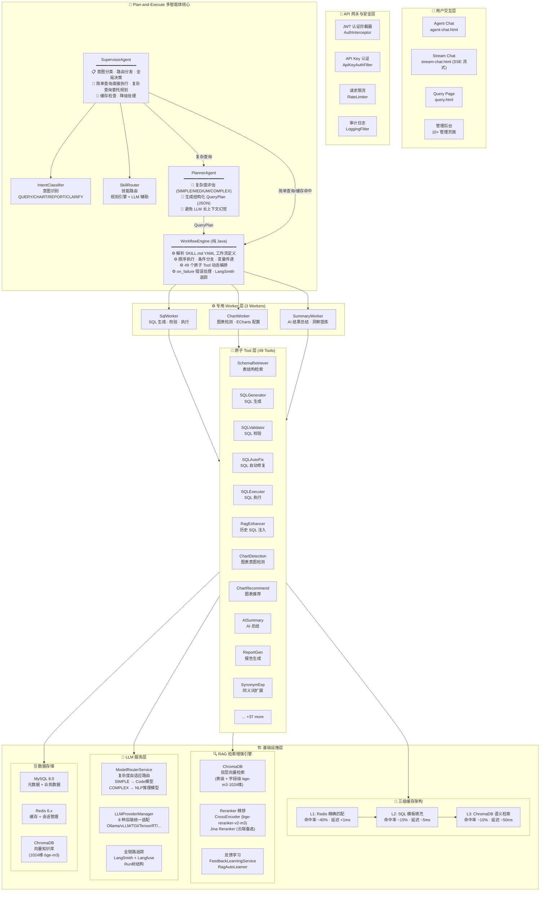

### 2. 核心组件详解

#### SupervisorAgent — 总指挥大脑

[SupervisorAgent.java](file:///d:/WorkSpace/idea%20workspace/NL2Sql/nl2sql-core/src/main/java/com/nl2sql/core/agent/SupervisorAgent.java)

系统总入口，采用 **Plan-and-Execute + Multi-Agent** 架构，是整个系统的核心调度中枢：

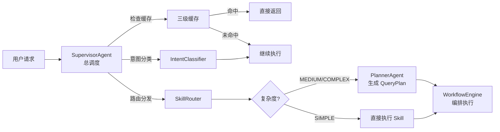

**核心职责：**
- **意图分类**：调用 `IntentClassifier` 识别用户意图（QUERY / CHART / REPORT / CLARIFY）
- **路由分发**：通过 `SkillRouter` 匹配最合适的 Skill（规则引擎 + LLM 辅助决策）
- **智能缓存**：优先检查三级缓存（Redis → Template → ChromaDB），命中直接返回
- **分级处理**：高置信度简单查询直接执行 Skill，复杂查询委托 PlannerAgent 生成 QueryPlan
- **降级保障**：FALLBACK 机制确保在任何异常情况下系统依然可用

#### PlannerAgent — 结构规划师

[PlannerAgent.java](file:///d:/WorkSpace/idea%20workspace/NL2Sql/nl2sql-core/src/main/java/com/nl2sql/core/agent/planner/PlannerAgent.java)

将模糊的自然语言问题转化为结构化的 `QueryPlan`（JSON 格式），是 Plan-and-Execute 架构中"Plan"的核心：

**三级复杂度评估算法：**

```
复杂度评分 = Σ(特征权重)
  ├─ 关键词数量 > 10     → +2
  ├─ 含聚合函数/统计词   → +2
  ├─ 含多表关联/JOIN     → +3
  ├─ 含时间范围查询      → +1
  ├─ 含嵌套/子查询       → +3
  └─ 含排序/分组         → +1
       │
       ▼
  总分 >= 8  → COMPLEX  → NLP 推理模型（如 qwen3:8b）
  总分 >= 4  → MEDIUM   → Code 模型 + RAG 增强
  总分 < 4   → SIMPLE   → Code 模型（直接执行，无需规划）
```

**QueryPlan 输出格式：**
```json
{
  "planId": "plan-2026-05-19-001",
  "complexity": "SIMPLE",
  "datasourceId": 1,
  "tables": ["orders", "regions"],
  "joinRelations": [{"left": "orders", "right": "regions", "on": "region_id"}],
  "steps": [
    {"action": "schema_retrieval", "tables": ["orders", "regions"]},
    {"action": "sql_generation", "aggregation": "SUM", "groupBy": "region"},
    {"action": "sql_execution", "riskLevel": "LOW"}
  ],
  "requiresChart": false,
  "requiresSummary": false
}
```

#### WorkflowEngine — 执行指挥官

[WorkflowEngine.java](file:///d:/WorkSpace/idea%20workspace/NL2Sql/nl2sql-core/src/main/java/com/nl2sql/core/agent/engine/WorkflowEngine.java)

**纯 Java 实现**（不依赖 Groovy 脚本），解析 `SKILL.md` 中的 YAML 工作流配置，按步骤调用底层 Tool。是 Plan-and-Execute 架构中"Execute"的执行中枢：

```
WorkflowEngine 执行流程
═══════════════════════════════════════
  SKILL.md (YAML)  ──parse──▶  WorkflowDefinition
                                      │
                                      ▼
                              For each Step:
                              ┌─────────────────────┐
                              │ 1. 条件检查          │
                              │    condition 表达式   │
                              │    满足 → 执行        │
                              │    不满足 → on_false  │
                              ├─────────────────────┤
                              │ 2. 变量解析          │
                              │    {{variable}} 替换  │
                              ├─────────────────────┤
                              │ 3. 工具调用          │
                              │    call_tool / call_skill / respond │
                              ├─────────────────────┤
                              │ 4. 结果收集          │
                              │    存入 output_var    │
                              ├─────────────────────┤
                              │ 5. 错误处理          │
                              │    on_failure: retry/fallback │
                              └─────────────────────┘
```

**核心能力：**
- **声明式编排**：YAML 定义工作流，业务逻辑与代码完全解耦，新增技能无需写 Java 代码
- **条件分支**：支持 `condition` 字段，根据运行时变量动态决定执行路径
- **变量传递**：通过 `{{variable}}` Mustache 模板语法在步骤间传递数据
- **Worker 注册**：`SqlWorker` / `ChartWorker` / `SummaryWorker` 分别处理不同阶段任务
- **错误处理**：`on_failure` / `on_condition_false` 配置，支持失败后重试或降级
- **链路追踪**：内置 `WorkflowTracingHelper`，每一步执行自动上报 LangSmith

> ⚠️ **历史演进说明：** 系统早期使用 `ReActAgent`（基于 Ollama 原生 Tool Calling 的推理-行动循环）和 `GroovySkillExecutor`（Groovy 脚本执行 Skills），两者已标记为 `@Deprecated`。当前架构为 **SupervisorAgent + PlannerAgent + WorkflowEngine (纯 Java)** 的 Plan-and-Execute 模式。

### 3. 系统交互流程（时序图）

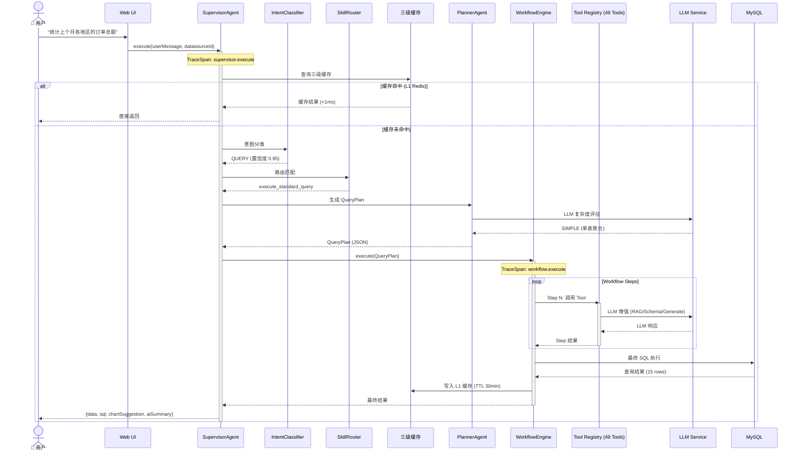

### 4. 三级缓存命中流程

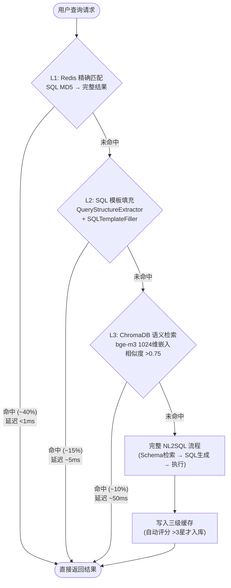

---

## 🔥 核心特性

### 1. Plan-and-Execute 多智能体架构

摒弃传统单一 Agent 或简单 ReAct 循环，采用 Plan-and-Execute 协作模式，实现意图识别、任务规划与工作流编排的深度解耦：

| 组件 | 职责 | 决策方式 | 文件 |
|------|------|---------|------|
| **SupervisorAgent** | 意图分类、路由分发、全局调度、缓存检查 | 规则 + LLM | [SupervisorAgent.java](file:///d:/WorkSpace/idea%20workspace/NL2Sql/nl2sql-core/src/main/java/com/nl2sql/core/agent/SupervisorAgent.java) |
| **IntentClassifier** | 识别 QUERY/CHART/REPORT/CLARIFY 意图 | 关键词匹配 + LLM | [IntentClassifier.java](file:///d:/WorkSpace/idea%20workspace/NL2Sql/nl2sql-core/src/main/java/com/nl2sql/core/agent/intent/IntentClassifier.java) |
| **SkillRouter** | 匹配最合适的 Skill（6 个内置 Skill） | 规则引擎 + LLM 辅助 | [SkillRouter.java](file:///d:/WorkSpace/idea%20workspace/NL2Sql/nl2sql-core/src/main/java/com/nl2sql/core/agent/routing/SkillRouter.java) |
| **PlannerAgent** | 三级复杂度评估 + 生成结构化 QueryPlan | LLM (JSON 结构化输出) | [PlannerAgent.java](file:///d:/WorkSpace/idea%20workspace/NL2Sql/nl2sql-core/src/main/java/com/nl2sql/core/agent/planner/PlannerAgent.java) |
| **WorkflowEngine** | 解析 SKILL.md YAML，编排 Tool 执行链 | YAML 声明式 | [WorkflowEngine.java](file:///d:/WorkSpace/idea%20workspace/NL2Sql/nl2sql-core/src/main/java/com/nl2sql/core/agent/engine/WorkflowEngine.java) |
| **SqlWorker** | SQL 生成、校验、修正、执行一体化 | 专用逻辑 + LLM | [SqlWorker.java](file:///d:/WorkSpace/idea%20workspace/NL2Sql/nl2sql-core/src/main/java/com/nl2sql/core/agent/worker/SqlWorker.java) |
| **ChartWorker** | 图表意图检测、ECharts 配置生成 | 规则 + LLM | [ChartWorker.java](file:///d:/WorkSpace/idea%20workspace/NL2Sql/nl2sql-core/src/main/java/com/nl2sql/core/agent/worker/ChartWorker.java) |
| **SummaryWorker** | AI 驱动数据洞察总结 | LLM | [SummaryWorker.java](file:///d:/WorkSpace/idea%20workspace/NL2Sql/nl2sql-core/src/main/java/com/nl2sql/core/agent/worker/SummaryWorker.java) |

**架构演进历程：**

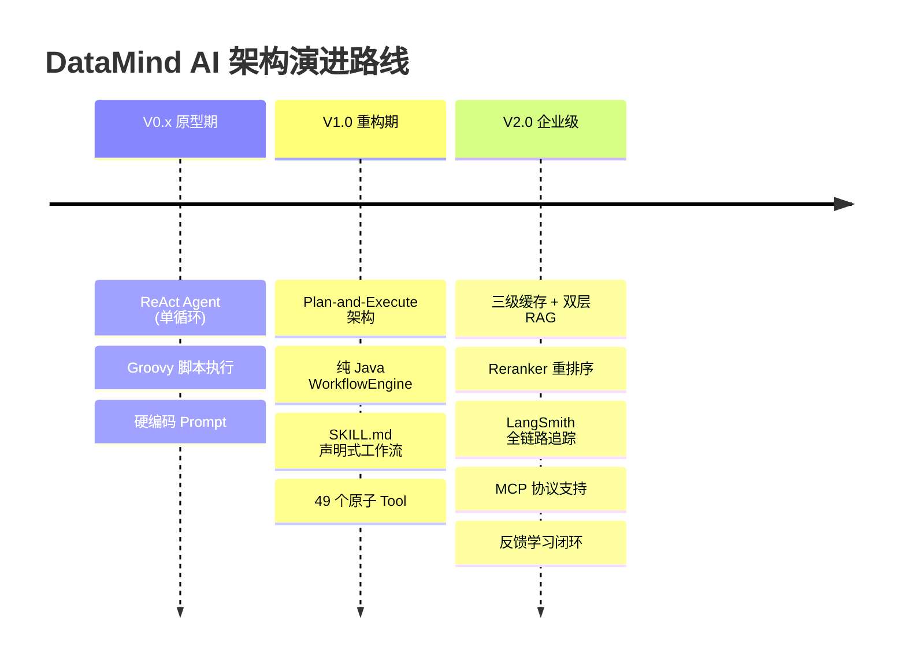

### 2. 三级缓存架构

独创三级缓存体系，综合命中率超过 **60%**，大幅减少 LLM 调用成本：

```
请求到达
  │
  ├─ L1: Redis 精确匹配
  │     └─ SQL 语义 MD5 哈希 → 完整查询结果 (List<Map>)
  │     └─ 命中率 ~40%，延迟 <1ms
  │     └─ TTL: 30 分钟自动过期
  │     └─ 实现: [QueryCacheService.java](file:///d:/WorkSpace/idea%20workspace/NL2Sql/nl2sql-core/src/main/java/com/nl2sql/core/cache/QueryCacheService.java)
  │              [QueryResultCache.java](file:///d:/WorkSpace/idea%20workspace/NL2Sql/nl2sql-core/src/main/java/com/nl2sql/core/cache/QueryResultCache.java)
  │
  ├─ L2: SQL 模板填充
  │     └─ [QueryStructureExtractor.java](file:///d:/WorkSpace/idea%20workspace/NL2Sql/nl2sql-core/src/main/java/com/nl2sql/core/cache/QueryStructureExtractor.java)
  │         提取查询结构（SELECT/WHERE/GROUP BY 骨架）
  │     └─ [SQLTemplateFiller.java](file:///d:/WorkSpace/idea%20workspace/NL2Sql/nl2sql-core/src/main/java/com/nl2sql/core/cache/SQLTemplateFiller.java)
  │         填充业务参数（时间词/人名/地点替换）
  │     └─ 行业提取器：电商(`EcommerceTargetExtractor`)、金融(`FinanceTargetExtractor`) 等
  │     └─ 命中率 ~15%，延迟 ~5ms
  │     └─ 5 星评分 SQL 自动入库到模板库
  │
  └─ L3: ChromaDB 向量检索
        └─ bge-m3 语义嵌入 (1024维，中文优化)
        └─ 余弦相似度计算，阈值 >0.75 自动匹配
        └─ Jaccard 相似度二次校验（防误匹配）
        └─ 命中率 ~10%，延迟 ~50ms
        └─ ChromaDB 不可用时自动降级到 Jaccard 纯文本匹配
        └─ 实现: [QueryCacheVectorService.java](file:///d:/WorkSpace/idea%20workspace/NL2Sql/nl2sql-core/src/main/java/com/nl2sql/core/cache/QueryCacheVectorService.java)
```

**缓存性能指标：**

| 层级 | 技术 | 命中率 | 延迟 | TTL | 降级策略 |
|------|------|:-----:|:----:|:---:|---------|
| L1 | Redis String | ~40% | <1ms | 30min | → L2 |
| L2 | Template Matching | ~15% | ~5ms | 永久 | → L3 |
| L3 | ChromaDB Vector | ~10% | ~50ms | 永久 | → Jaccard |
| **合计** | **三级串联** | **~60%** | **加权 <5ms** | — | — |

### 3. RAG 检索增强生成

系统内置完整的 RAG（Retrieval-Augmented Generation）引擎，覆盖从知识入库到检索增强的全生命周期：

```
RAG 工作流程
═══════════════════════════════════════
  用户查询 "统计上个月各地区的订单总额"
          │
          ▼
  ┌──────────────────────────────┐
  │ Step 1: 双层向量检索         │
  │  ┌─ 表级向量检索             │
  │  │   bge-m3 (1024维)         │
  │  │   匹配 relevant tables    │
  │  └─ 字段级向量检索           │
  │      bge-m3 (1024维)         │
  │      匹配 relevant columns   │
  └──────────────┬───────────────┘
                 ▼
  ┌──────────────────────────────┐
  │ Step 2: 历史 SQL 注入        │
  │  RagEnhancerTool             │
  │  检索 Top-3 相似历史 SQL      │
  │  作为 Few-shot 示例注入      │
  └──────────────┬───────────────┘
                 ▼
  ┌──────────────────────────────┐
  │ Step 3: 迭代式表发现         │
  │  IterativeTableDiscoveryTool │
  │  最多 3 轮 LLM 交互           │
  │  逐步精确锁定所需表           │
  └──────────────┬───────────────┘
                 ▼
  ┌──────────────────────────────┐
  │ Step 4: 行业语义注入         │
  │  IndustryConceptInjectorTool │
  │  "总额" → SUM(actual_amount) │
  │  "地区" → regions.name       │
  └──────────────┬───────────────┘
                 ▼
  ┌──────────────────────────────┐
  │ Step 5: SQL 生成             │
  │  LLM + 增强后的上下文         │
  │  生成准确 SQL                 │
  └──────────────────────────────┘
```

**RAG 知识库运维特性：**

| 特性 | 说明 | 实现 |
|------|------|------|
| **双层向量检索** | 表级 + 字段级，bge-m3 嵌入模型（1024维，中文优化） | [ChromaVectorService.java](file:///d:/WorkSpace/idea%20workspace/NL2Sql/nl2sql-core/src/main/java/com/nl2sql/core/rag/ChromaVectorService.java) |
| **自动入库** | 5 星评分的 SQL 自动解析并存入向量库（质量评分 >0.7） | [RagAutoLearner.java](file:///d:/WorkSpace/idea%20workspace/NL2Sql/nl2sql-core/src/main/java/com/nl2sql/core/rag/RagAutoLearner.java) |
| **三级降级** | ChromaDB → MySQL 向量 → MySQL 全文检索 | [MySqlVectorService.java](file:///d:/WorkSpace/idea%20workspace/NL2Sql/nl2sql-core/src/main/java/com/nl2sql/core/rag/MySqlVectorService.java) |
| **多向量库后端** | 统一 `VectorStoreProvider` 接口，支持 4 种后端：ChromaDB / MySQL / Milvus / Qdrant，一行配置切换 | [VectorStoreManager.java](file:///d:/WorkSpace/idea%20workspace/NL2Sql/nl2sql-core/src/main/java/com/nl2sql/core/rag/provider/VectorStoreManager.java) |
| **Prompt 学习** | 低分反馈触发的 Prompt 模板自动优化 | [PromptLearningService.java](file:///d:/WorkSpace/idea%20workspace/NL2Sql/nl2sql-core/src/main/java/com/nl2sql/core/rag/PromptLearningService.java) |
| **低分过滤** | 自动识别并过滤低质量 RAG 示例 | [LowRatingExampleService.java](file:///d:/WorkSpace/idea%20workspace/NL2Sql/nl2sql-core/src/main/java/com/nl2sql/core/rag/LowRatingExampleService.java) |
| **A/B 测试** | 支持 RAG 策略 A/B 对比测试 | [ABTestRequest.java](file:///d:/WorkSpace/idea%20workspace/NL2Sql/nl2sql-core/src/main/java/com/nl2sql/core/rag/dto/ABTestRequest.java) |

### 4. 多模型智能路由

[ModelRouterService.java](file:///d:/WorkSpace/idea%20workspace/NL2Sql/nl2sql-core/src/main/java/com/nl2sql/core/llm/ModelRouterService.java)

自动评估查询复杂度，动态选择最优 LLM 模型，兼顾效果与成本：

```
用户查询 "统计各地区销售额，并按季度对比增长率"
                    │
                    ▼
          ModelRouterService.assessComplexity()
                    │
     ┌──────────────┼──────────────┐
     │ 关键词数量 12   → +2         │
     │ 含聚合函数      → +2         │
     │ 含多表关联      → +3         │
     │ 含时间范围      → +1         │
     │ 含排序/分组     → +1         │
     └──────────────┼──────────────┘
                    │
              总分 = 9
                    │
                    ▼
         COMPLEX → NLP 推理模型 (qwen3:8b)
                    带思维链推理 + 长上下文支持
```

| 复杂度 | 分值 | 路由模型 | 场景示例 |
|:------:|:----:|---------|---------|
| **SIMPLE** | 0-3 | Code 模型 (qwen2.5-coder:7b) | "查询昨天的订单数" |
| **MEDIUM** | 4-7 | Code 模型 + RAG 增强 | "统计各品类月度销售额" |
| **COMPLEX** | 8+ | NLP 推理模型 (qwen3:8b) | "找出销售额最高的前10个商品并分析增速" |

**支持的 LLM 后端（8 种）：**

| 后端 | 类型 | 特点 | 配置标识 |
|------|------|------|---------|
| **Ollama** | 本地 | 零成本、低延迟、推荐开发环境 | `ollama` |
| **vLLM** | 本地 | 高吞吐、PagedAttention 加速 | `vllm` |
| **TGI** | 本地 | HuggingFace 官方推理服务 | `tgi` |
| **TensorRT-LLM** | 本地 | NVIDIA GPU 极致优化 | `tensorrt` |
| **llama.cpp** | 本地 | CPU 友好、量化模型支持 | `llamacpp` |
| **ChatGLM** | 本地 | 清华开源、中文优化 | `chatglm` |
| **Qwen** | 本地/云端 | 阿里通义千问系列 | `qwen` |
| **阿里云百炼** | 云端 | 生产级 API、企业级 SLA | `aliyun` |

统一 `LLMProvider` 接口，新增后端只需实现一个接口。`LLMProviderManager` 管理多后端优先级与自动故障转移。

### 5. 检索结果重排序

在 RAG 初排（向量检索）基础上引入 Cross-Encoder 精排，显著提升检索精度。初排关注召回（Recall），精排关注准确（Precision）：

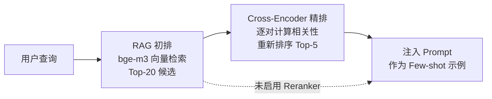

| 实现 | 模型 | 部署方式 | 特点 |
|------|------|---------|------|
| **CrossEncoderReranker** | bge-reranker-v2-m3 | HuggingFace TEI 服务 (Docker)、本地 GPU 推理 | 高精度、低延迟、完全私有化 |
| **JinaReranker** | jina-reranker-v2 | Jina AI API (云端) | 无需 GPU、快速接入、按量付费 |

**核心实现类：**
- [CrossEncoderReranker.java](file:///d:/WorkSpace/idea%20workspace/NL2Sql/nl2sql-core/src/main/java/com/nl2sql/core/rerank/CrossEncoderReranker.java) — 本地 TEI 精排
- [JinaReranker.java](file:///d:/WorkSpace/idea%20workspace/NL2Sql/nl2sql-core/src/main/java/com/nl2sql/core/rerank/JinaReranker.java) — 云端 Jina API
- [RerankerConfig.java](file:///d:/WorkSpace/idea%20workspace/NL2Sql/nl2sql-core/src/main/java/com/nl2sql/core/rerank/RerankerConfig.java) — 自动配置与降级，TEI 不可用时自动切换 Jina

### 6. SQL 自动纠错与 Self-Correction

[ErrorClassifier.java](file:///d:/WorkSpace/idea%20workspace/NL2Sql/nl2sql-core/src/main/java/com/nl2sql/core/error/ErrorClassifier.java)

智能错误识别 + 差异化重试策略，支持 **6 种错误类型**的自动分类：

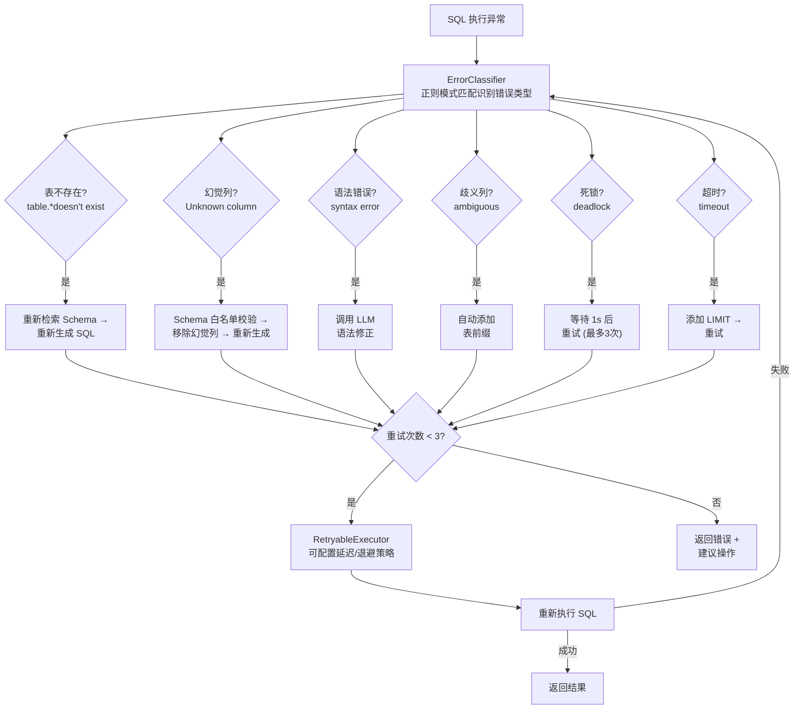

| 错误类型 | 检测模式 | 重试策略 | 处理文件 |
|---------|---------|---------|---------|
| 表不存在 | `table.*doesn't exist` | 重新检索 Schema → 重新生成 SQL | [ErrorClassifier.java](file:///d:/WorkSpace/idea%20workspace/NL2Sql/nl2sql-core/src/main/java/com/nl2sql/core/error/ErrorClassifier.java) |
| 列不存在（幻觉列） | `Unknown column` | Schema 白名单校验 → 移除幻觉列 → 重新生成 | [SQLCorrectionService.java](file:///d:/WorkSpace/idea%20workspace/NL2Sql/nl2sql-core/src/main/java/com/nl2sql/core/service/SQLCorrectionService.java) |
| SQL 语法错误 | `syntax error` | 调用 LLM 语法修正 | [SQLAutoFixTool.java](file:///d:/WorkSpace/idea%20workspace/NL2Sql/nl2sql-core/src/main/java/com/nl2sql/core/agent/tools/SQLAutoFixTool.java) |
| 歧义列 | `ambiguous` | 自动添加表前缀 | [CorrectSqlTool.java](file:///d:/WorkSpace/idea%20workspace/NL2Sql/nl2sql-core/src/main/java/com/nl2sql/core/agent/tools/CorrectSqlTool.java) |
| 死锁 | `deadlock` | 等待 1s 后重试（最多 3 次） | [RetryableExecutor.java](file:///d:/WorkSpace/idea%20workspace/NL2Sql/nl2sql-core/src/main/java/com/nl2sql/core/error/RetryableExecutor.java) |
| 超时 | `timeout` | 添加 LIMIT 限制 → 重试 | `RetryableExecutor` |

**安全保障：**
- 最多 **3 次**自动重试，防止无限循环
- `RetryableExecutor` 支持可配置延迟、指数退避策略和最大重试次数
- 语法修正 → 聚合修正 → 幻觉修正，逐步修复 pipeline

### 7. 企业级安全防护

四层纵深防护体系，满足金融级安全合规要求：

```
┌─────────────────────────────────────────────────────┐
│                 🔐 四层纵深防护体系                     │
├─────────────────────────────────────────────────────┤
│                                                     │
│  Layer 1: JWT 认证                                   │
│  ┌─────────────────────────────────────────────┐    │
│  │  AuthInterceptor · ApiKeyAuthFilter          │    │
│  │  Token 验签 + 过期检测 + 用户身份解析         │    │
│  └─────────────────────────────────────────────┘    │
│                       │                             │
│                       ▼                             │
│  Layer 2: 表级权限                                   │
│  ┌─────────────────────────────────────────────┐    │
│  │  TablePermissionMapper                       │    │
│  │  控制用户可访问的数据表和数据库                │    │
│  │  支持按数据源级联权限管理                      │    │
│  └─────────────────────────────────────────────┘    │
│                       │                             │
│                       ▼                             │
│  Layer 3: 列级脱敏                                   │
│  ┌─────────────────────────────────────────────┐    │
│  │  ColumnPermissionService                     │    │
│  │  精确到列的访问权限和脱敏策略                  │    │
│  │  手机号/身份证/银行卡 自动掩码                 │    │
│  └─────────────────────────────────────────────┘    │
│                       │                             │
│                       ▼                             │
│  Layer 4: SQL AST 安全校验                           │
│  ┌─────────────────────────────────────────────┐    │
│  │  SQLSecurityValidator (JSqlParser)            │    │
│  │  ├─ DDL 拦截: DROP/ALTER/CREATE/TRUNCATE     │    │
│  │  ├─ DML 写操作拦截: DELETE/UPDATE/INSERT      │    │
│  │  ├─ 注入防护: 多语句检测/注释隐藏检测          │    │
│  │  ├─ 敏感函数: LOAD_FILE/INTO OUTFILE/BENCHMARK│    │
│  │  ├─ JOIN 限制: 最多 2 个 JOIN                 │    │
│  │  └─ 全表扫描防护: 无 WHERE+无 LIMIT 拦截      │    │
│  └─────────────────────────────────────────────┘    │
│                                                     │
└─────────────────────────────────────────────────────┘
```

**核心实现类：**
- [SQLSecurityValidator.java](file:///d:/WorkSpace/idea%20workspace/NL2Sql/nl2sql-security/src/main/java/com/nl2sql/security/SQLSecurityValidator.java) — AST 级别安全校验
- [ColumnPermissionService.java](file:///d:/WorkSpace/idea%20workspace/NL2Sql/nl2sql-security/src/main/java/com/nl2sql/security/ColumnPermissionService.java) — 列级权限与脱敏
- [AuthService.java](file:///d:/WorkSpace/idea%20workspace/NL2Sql/nl2sql-core/src/main/java/com/nl2sql/auth/service/AuthService.java) — JWT 认证服务

### 8. 行业语义理解

内置 **5 大行业**语义词典，支持动态加载和自定义扩展：

| 行业 | 核心概念 | 示例映射 |
|------|---------|---------|
| 🛒 **电商** | 订单、商品、用户、店铺、库存、物流 | "GMV" → `SUM(actual_amount)` |
| 💰 **金融** | 账户、交易、理财、贷款、风控 | "收益率" → `(end_value - start_value) / start_value` |
| 🏥 **医疗** | 患者、病历、处方、药品、科室 | "就诊人次" → `COUNT(DISTINCT patient_id)` |
| 🎓 **教育** | 学生、课程、成绩、教师、班级 | "及格率" → `SUM(score>=60)/COUNT(*)` |
| 🏭 **制造业** | 产品、产线、工单、质检、库存 | "良品率" → `SUM(quality='OK')/COUNT(*)` |

**核心能力：**
- **同义词词典**：[SynonymService.java](file:///d:/WorkSpace/idea%20workspace/NL2Sql/nl2sql-core/src/main/java/com/nl2sql/core/llm/SynonymService.java) 自动识别业务术语（订单/定单、用户/客户），从 `industry_concept` 表动态加载
- **行业概念字典**：[IndustryConceptDictionary.java](file:///d:/WorkSpace/idea%20workspace/NL2Sql/nl2sql-core/src/main/java/com/nl2sql/core/llm/IndustryConceptDictionary.java) 五大行业映射，支持管理后台在线编辑
- **语义映射扩展**：可插拔 `SemanticMappingExtension` 接口，新增行业只需添加一个实现类
- **行业 Prompt 注入**：`IndustryConceptExtension` 四层扩展（术语理解 → SQL 干预 → 语义校验 → 持续学习）
- **时间表达式解析**：[TimeExpressionParser.java](file:///d:/WorkSpace/idea%20workspace/NL2Sql/nl2sql-core/src/main/java/com/nl2sql/core/agent/preprocessing/TimeExpressionParser.java) 智能解析"昨天"、"最近 7 天"、"上个月"、"本季度"等
- **地理位置语义**：[LocationSemanticService.java](file:///d:/WorkSpace/idea%20workspace/NL2Sql/nl2sql-core/src/main/java/com/nl2sql/core/llm/LocationSemanticService.java) "华东" → `region IN ('上海','江苏','浙江','安徽')`
- **智能术语建议**：[TermSuggestionController.java](file:///d:/WorkSpace/idea%20workspace/NL2Sql/nl2sql-web/src/main/java/com/nl2sql/web/controller/TermSuggestionController.java) 用户输入时自动补全行业术语，基于 HanLP 分词 + Caffeine L1 + Redis L2 缓存，毫秒级响应
- **术语自动生成**：[TermAutoGenerateService.java](file:///d:/WorkSpace/idea%20workspace/NL2Sql/nl2sql-core/src/main/java/com/nl2sql/metadata/service/TermAutoGenerateService.java) 三层架构自动爬库生成术语——底层从 `information_schema` 提取结构 → 中层 LLM 扩词（DDL→同义词/口语） → 上层前端选词约束
- **列名智能翻译**：[TranslationController.java](file:///d:/WorkSpace/idea%20workspace/NL2Sql/nl2sql-web/src/main/java/com/nl2sql/web/controller/TranslationController.java) 英文列名自动翻译为中文，支持批量翻译 + Caffeine/Redis 两级缓存，翻译结果自动入库供下次复用

### 9. 全链路可观测性

集成 **LangSmith** 和 **Langfuse** 两大追踪平台，实现从用户请求到 SQL 执行的全链路可观测：

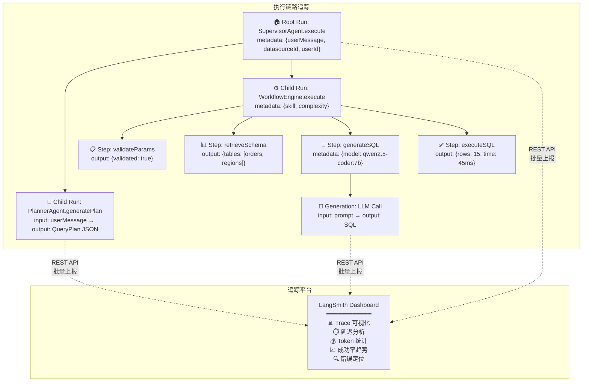

**核心特性：**
- **可插拔设计**：LangSmith 未配置时自动跳过，零性能损耗；通过 `@ConditionalOnProperty` 控制加载
- **Run 树结构**：父子 Run 自动关联（`traceChain` → `traceSpan` → `traceGeneration`），完整还原执行路径
- **自定义 Metadata**：支持按复杂度、数据源、用户、Skill 等维度筛选和分析
- **双平台支持**：LangSmith + Langfuse，通过 `tracing.provider` 配置一键切换
- **反馈关联**：用户评分自动上报到 LangSmith，支持线上评估与持续优化

**核心实现类：**
- [LangSmithTracingService.java](file:///d:/WorkSpace/idea%20workspace/NL2Sql/nl2sql-core/src/main/java/com/nl2sql/core/tracing/LangSmithTracingService.java) — LangSmith REST API 集成
- [LangfuseTracingService.java](file:///d:/WorkSpace/idea%20workspace/NL2Sql/nl2sql-core/src/main/java/com/nl2sql/core/tracing/LangfuseTracingService.java) — Langfuse 集成
- [TracingConfig.java](file:///d:/WorkSpace/idea%20workspace/NL2Sql/nl2sql-core/src/main/java/com/nl2sql/core/tracing/TracingConfig.java) — 配置管理
- [WorkflowTracingHelper.java](file:///d:/WorkSpace/idea%20workspace/NL2Sql/nl2sql-core/src/main/java/com/nl2sql/core/agent/engine/WorkflowTracingHelper.java) — Workflow 步骤级追踪

### 10. 反馈学习闭环

[FeedbackLearningService.java](file:///d:/WorkSpace/idea%20workspace/NL2Sql/nl2sql-core/src/main/java/com/nl2sql/core/rag/FeedbackLearningService.java)

形成"用户反馈 → 错误分析 → 知识修正 → 效果提升"的完整闭环，系统越用越准：

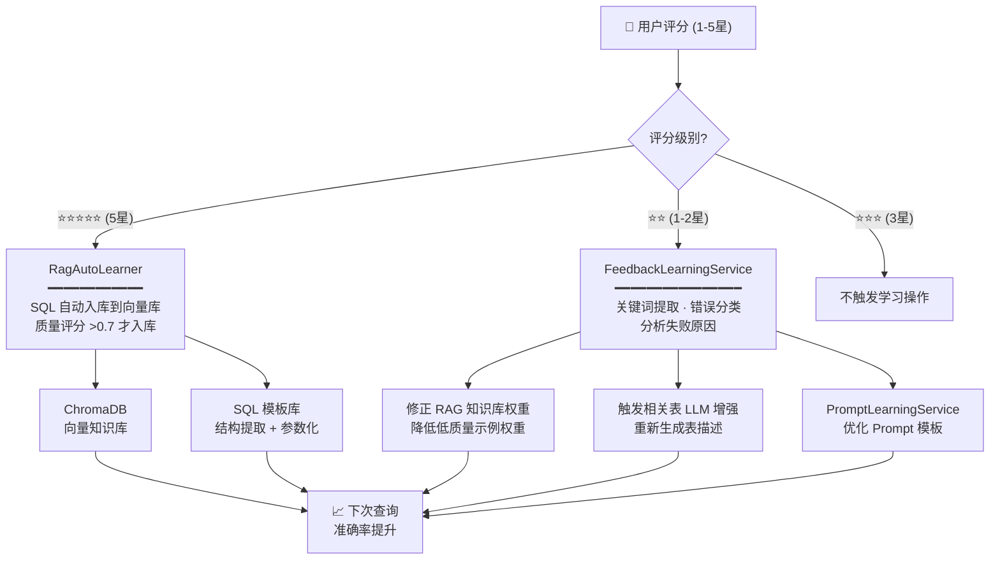

**闭环节点说明：**

| 节点 | 触发条件 | 执行动作 | 实现文件 |
|------|---------|---------|---------|
| **正向学习** | 评分 = 5 星 | SQL 自动解析入库（向量 + 模板），质量评分 >0.7 | [RagAutoLearner.java](file:///d:/WorkSpace/idea%20workspace/NL2Sql/nl2sql-core/src/main/java/com/nl2sql/core/rag/RagAutoLearner.java) |
| **负向学习** | 评分 = 1-2 星 | 关键词提取 → 错误分类 → 知识权重调整 → 表级 LLM 增强 | [FeedbackLearningService.java](file:///d:/WorkSpace/idea%20workspace/NL2Sql/nl2sql-core/src/main/java/com/nl2sql/core/rag/FeedbackLearningService.java) |
| **自动评分** | SQL 执行完成 | AI 自动评估 SQL 质量（语法正确性 + 结果合理性） | [SQLAutoRatingService.java](file:///d:/WorkSpace/idea%20workspace/NL2Sql/nl2sql-core/src/main/java/com/nl2sql/core/rag/SQLAutoRatingService.java) |
| **Prompt 优化** | 低分反馈积累 | Prompt 模板参数微调 | [PromptLearningService.java](file:///d:/WorkSpace/idea%20workspace/NL2Sql/nl2sql-core/src/main/java/com/nl2sql/core/rag/PromptLearningService.java) |
| **低分示例过滤** | 入库前检查 | 过滤历史低质量 RAG 示例，避免污染知识库 | [LowRatingExampleService.java](file:///d:/WorkSpace/idea%20workspace/NL2Sql/nl2sql-core/src/main/java/com/nl2sql/core/rag/LowRatingExampleService.java) |

### 11. SKILL.md 声明式工作流

系统内置 **6 个 Skill**，通过 YAML 格式的 `SKILL.md` 定义工作流，实现业务逻辑与 Java 代码的完全解耦。新增技能只需在 `skills/` 目录下创建 `SKILL.md` 文件，系统自动扫描加载：

| Skill 名称 | 分类 | 功能说明 | 工作流步骤 | 文件 |
|-----------|:---:|---------|-----------|------|
| `standard-query` | query | 标准数据查询，覆盖完整 NL2SQL 链路 | 参数校验 → 图表检测 → Schema检索 → SQL生成 → 风险评估 → 人机协同 → SQL执行 → 结果组装 | [SKILL.md](file:///d:/WorkSpace/idea%20workspace/NL2Sql/nl2sql-web/src/main/resources/skills/standard-query/SKILL.md) |
| `report-with-insights` | analysis | 报表与洞察，标准查询 + AI总结 + 图表推荐 | 标准查询 → AI总结 → 图表推荐 | [SKILL.md](file:///d:/WorkSpace/idea%20workspace/NL2Sql/nl2sql-web/src/main/resources/skills/report-with-insights/SKILL.md) |
| `sql-validate-execute` | validation | SQL 校验与安全执行 | Schema检索 → SQL校验 → 风险评估 → SQL执行 | [SKILL.md](file:///d:/WorkSpace/idea%20workspace/NL2Sql/nl2sql-web/src/main/resources/skills/sql-validate-execute/SKILL.md) |
| `sql-performance-analysis` | optimization | SQL 性能分析，慢查询诊断 | 索引检查 → 执行计划分析 → 优化建议 | [SKILL.md](file:///d:/WorkSpace/idea%20workspace/NL2Sql/nl2sql-web/src/main/resources/skills/sql-performance-analysis/SKILL.md) |
| `summarize-result` | postprocess | 结果总结，AI 提炼数据洞察 | 数据分析 → AI总结生成 | [SKILL.md](file:///d:/WorkSpace/idea%20workspace/NL2Sql/nl2sql-web/src/main/resources/skills/summarize-result/SKILL.md) |
| `hybrid-example` | demo | 混合示例，演示多种 Tool 组合 | 组合多种 Tool 类型 | [SKILL.md](file:///d:/WorkSpace/idea%20workspace/NL2Sql/nl2sql-web/src/main/resources/skills/hybrid-example/SKILL.md) |

**SKILL.md 核心语法：**
```yaml
workflow:
  version: 2.0
  steps:
    - id: validate_params            # 步骤 ID
      action: call_tool              # 动作类型: call_tool / call_skill / respond
      tool: validateParams           # 目标 Tool 名称
      input:                         # 输入参数 (支持 {{variable}} 模板)
        question: "{{question}}"
      output_var: validation_result  # 输出变量名
      on_next: detect_chart          # 成功后下一步
      on_condition_false: respond_clarification  # 条件不满足时的分支
```

### 12. 动态 Prompt 工程

[PromptModule.java](file:///d:/WorkSpace/idea%20workspace/NL2Sql/nl2sql-core/src/main/java/com/nl2sql/core/agent/prompt/PromptModule.java)

模块化 Prompt 构建器，根据用户意图动态组装最精简的 System Prompt，避免冗余 Token 消耗：

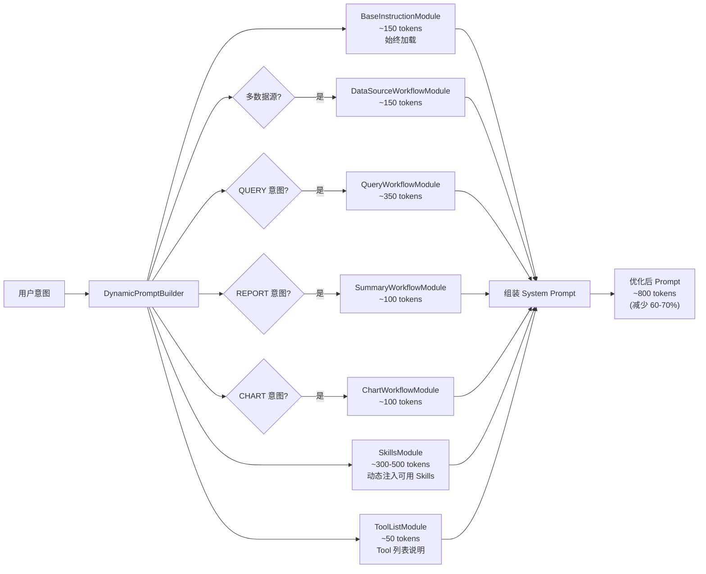

| 模块 | 触发条件 | Token 估算 | 说明 |
|------|---------|:---------:|------|
| `BaseInstructionModule` | 始终加载 | ~150 | 角色定义 + 基础规则 + 安全约束 |
| `DataSourceWorkflowModule` | 多数据源环境 | ~150 | 数据源选择规则 + 动态 HikariCP 说明 |
| `QueryWorkflowModule` | QUERY 意图 | ~350 | SQL 生成规范 + Schema 检索指引 |
| `SummaryWorkflowModule` | REPORT 意图 | ~100 | AI 总结模板 + 洞察提炼规范 |
| `ChartWorkflowModule` | CHART 意图 | ~100 | 图表推荐规则 + ECharts 配置格式 |
| `SkillsModule` | 动态注入 | ~300-500 | 可用 Skills 列表 + 选择指引 |
| `ToolListModule` | 动态注入 | ~50 | Tool 功能说明与参数格式 |

**效果：Token 减少 60-70%**（从 ~2500 降至 ~800），内置缓存机制使相同意图复用已构建的 Prompt。

### 13. 事件驱动监控与 AOP 性能度量

系统内置完整的 **事件驱动监控体系**，通过 Spring Event + AOP 切面 + ThreadLocal 上下文，实现从请求到执行的全链路性能数据采集与异步持久化：

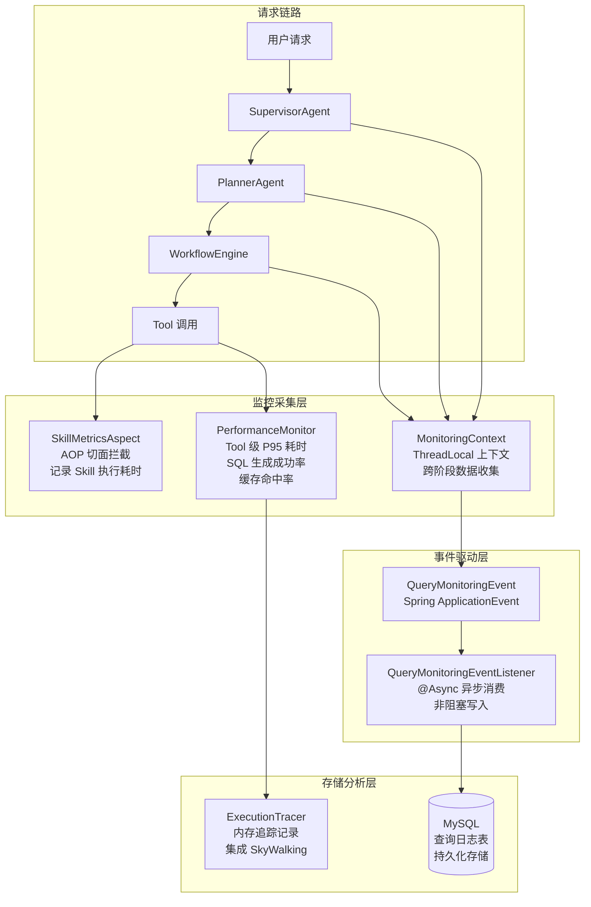

**监控维度全覆盖：**

| 监控维度 | 采集方式 | 指标 | 实现文件 |
|---------|---------|------|---------|
| **Skill 执行监控** | AOP 切面自动拦截 | 每个 Skill 的 QPS、成功率、平均耗时、P95 耗时 | [SkillMetricsAspect.java](file:///d:/WorkSpace/idea%20workspace/NL2Sql/nl2sql-core/src/main/java/com/nl2sql/core/agent/monitoring/SkillMetricsAspect.java) |
| **Tool 性能度量** | 代码埋点 + 原子计数器 | 46 个 Tool 的调用次数、成功率、平均耗时 | [PerformanceMonitor.java](file:///d:/WorkSpace/idea%20workspace/NL2Sql/nl2sql-core/src/main/java/com/nl2sql/core/monitor/PerformanceMonitor.java) |
| **SQL 生成质量** | 生成前后拦截 | 一次生成成功率、修正后成功率、平均修正次数 | `PerformanceMonitor` |
| **缓存效果追踪** | 三级缓存命中埋点 | L1/L2/L3 各级命中率、缓存写入率 | `PerformanceMonitor` |
| **全链路上下文** | ThreadLocal 传递 | sessionId / userId / cacheLevel / generatedSql / executionTime | [MonitoringContext.java](file:///d:/WorkSpace/idea%20workspace/NL2Sql/nl2sql-core/src/main/java/com/nl2sql/core/service/MonitoringContext.java) |
| **异步事件持久化** | Spring Event + @Async | 查询日志写入 MySQL（不阻塞主链路） | [QueryMonitoringEventListener.java](file:///d:/WorkSpace/idea%20workspace/NL2Sql/nl2sql-core/src/main/java/com/nl2sql/core/event/QueryMonitoringEventListener.java) |
| **执行追踪** | 内存 Trace 树 | 完整执行链路记录、阶段耗时、错误定位 | [ExecutionTracer.java](file:///d:/WorkSpace/idea%20workspace/NL2Sql/nl2sql-core/src/main/java/com/nl2sql/core/observability/ExecutionTracer.java) |

**核心设计思想：**
- **非侵入采集**：AOP 切面 + ThreadLocal 上下文，对业务代码零侵入
- **异步非阻塞**：监控数据通过 Spring Event 异步写入数据库，不占用请求主链路
- **多维可观测**：LangSmith 外部追踪 + 内部 AOP 度量 + 事件驱动日志，三层互补
- **可扩展**：`ExecutionTracer` 预留 Prometheus / SkyWalking 集成接口

### 14. 人机协同 (Human-in-the-Loop)

当 AI 遇到不确定性或高风险场景时，系统不会盲目决策，而是将决策权交还给用户。DataMind AI 内置三个关键的人机协同节点：

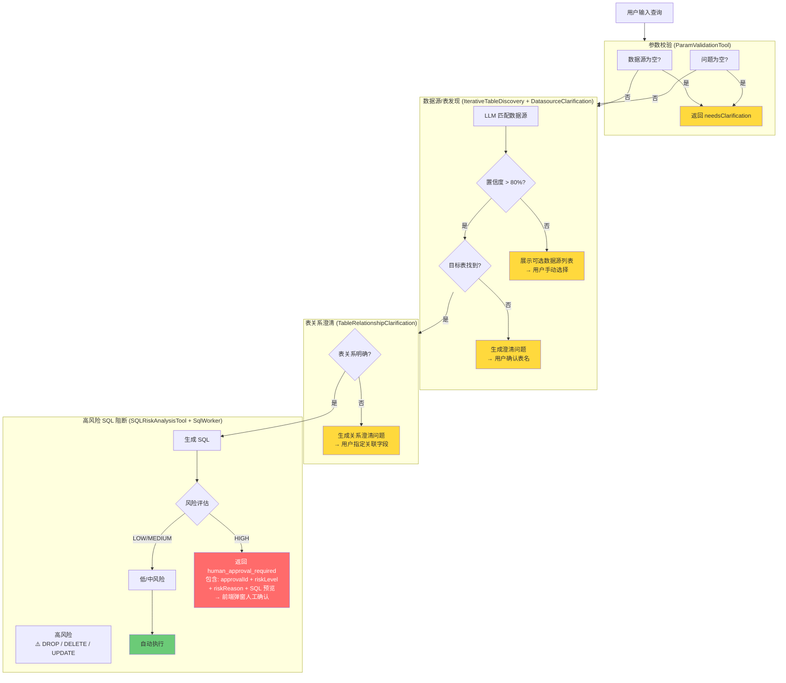

#### 14.1 数据源智能发现与选择

系统在查询前自动进行多轮迭代式数据源发现。当低置信度或目标表无法定位时，不会强行猜测，而是降级到人工选择。

**两阶段澄清机制：**

| 阶段 | 触发条件 | 执行工具 | 人工交互 |
|------|---------|---------|---------|
| **数据源选择** | LLM 匹配置信度 < 80%，或用户未指定数据源 | `DatasourceClarificationTool` | 展示所有可用数据源列表，用户手动选择 |
| **表名确认** | `IterativeTableDiscovery` 多轮搜索仍找不到目标表 | `IterativeTableDiscovery` + `TableSelectionOrchestrator` | 返回 `needsClarification` + 澄清问题，用户确认或手动指定表名 |

关键实现：[DatasourceClarificationTool.java](file:///d:/WorkSpace/idea%20workspace/NL2Sql/nl2sql-core/src/main/java/com/nl2sql/core/agent/tools/DatasourceClarificationTool.java) 调用 LLM 根据用户问题推断数据源领域，低置信度时返回完整列表。

#### 14.2 表关系澄清

当多表 JOIN 场景下系统无法确定表之间的关联关系时，`TableRelationshipClarificationTool` 自动生成澄清问题让用户指定关联字段，避免生成错误的 JOIN 条件。

关键实现：[TableRelationshipClarificationTool.java](file:///d:/WorkSpace/idea%20workspace/NL2Sql/nl2sql-core/src/main/java/com/nl2sql/core/agent/tools/TableRelationshipClarificationTool.java)

#### 14.3 高风险 SQL 人工确认

这是最核心的安全防线。SQL 生成后经过 `SQLRiskAnalysisTool` 风险评估，**高风险 SQL（DROP / DELETE / UPDATE / 无 WHERE 的大范围操作）会被立即阻断**，不进入执行流程，而是返回结构化审批请求到前端。

**返回格式（JSON）：**

```json
{
  "type": "human_approval_required",
  "approvalId": "risk_1716850000000",
  "riskLevel": "HIGH",
  "riskReason": "检测到 DELETE 语句且未包含 WHERE 条件",
  "sql": "DELETE FROM orders WHERE create_time < '2025-01-01'",
  "optimizationSuggestion": "建议添加 LIMIT 限制删除行数",
  "message": "该 SQL 存在高风险，请审核后再决定是否执行"
}
```

**工作流层接收处理：**

- `WorkflowStepExecutor` 检测到 Tool 返回 `human_approval_required` → 停止工作流，将审批请求返回前端
- `Worker.waitingForApproval()` 工厂方法创建待审批状态，`WorkflowResultAssembler` 将审批信息组装到最终响应中
- 审批通过后前端携带 `approvalId` 重新发起执行请求

**实现链路：** [SQLRiskAnalysisTool.java](file:///d:/WorkSpace/idea%20workspace/NL2Sql/nl2sql-core/src/main/java/com/nl2sql/core/agent/tools/SQLRiskAnalysisTool.java) → [SqlWorker.java](file:///d:/WorkSpace/idea%20workspace/NL2Sql/nl2sql-core/src/main/java/com/nl2sql/core/agent/worker/SqlWorker.java) → [WorkflowStepExecutor.java](file:///d:/WorkSpace/idea%20workspace/NL2Sql/nl2sql-core/src/main/java/com/nl2sql/core/agent/engine/WorkflowStepExecutor.java) → [WorkflowResultAssembler.java](file:///d:/WorkSpace/idea%20workspace/NL2Sql/nl2sql-core/src/main/java/com/nl2sql/core/agent/engine/WorkflowResultAssembler.java)

### 15. Prompt A/B 测试与版本管理

Prompt 是 LLM 应用的灵魂，DataMind AI 内置了完整的 **Prompt 版本管理和自动 A/B 测试框架**，支持用数据驱动的方式持续优化 Prompt 质量——这是目前所有开源 NL2SQL 框架中**独有的能力**。

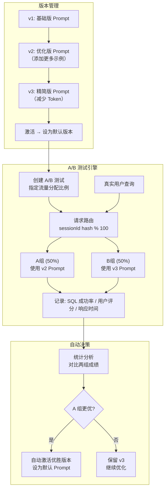

**核心能力：**

| 能力 | 说明 | 实现文件 |
|------|------|---------|
| **Prompt 版本管理** | 创建、编辑、列表、激活 Prompt 版本，支持按类型分组（QUERY/CHART/REPORT） | [PromptLearningService.java](file:///d:/WorkSpace/idea%20workspace/NL2Sql/nl2sql-core/src/main/java/com/nl2sql/core/rag/PromptLearningService.java) |
| **A/B 测试创建** | 指定两个版本 + 流量分配比例 + 最少样本数，`sessionId` hash 自动分流 | `PromptLearningService.createABTest()` |
| **实时路由** | 按 `sessionId % 100` 哈希分流，同一会话始终使用同一版本，保证体验一致 | `PromptLearningService.routeABTest()` |
| **自动决策** | 测试结束后自动统计对比各组 SQL 成功率 + 用户评分，**自动激活优胜版本** | `PromptLearningService.stopABTest()` |
| **管理后台** | 完整 REST API（12 个端点），支持前端可视化操作 | [PromptLearningController.java](file:///d:/WorkSpace/idea%20workspace/NL2Sql/nl2sql-web/src/main/java/com/nl2sql/web/controller/PromptLearningController.java) |
| **使用追踪** | 每次 Prompt 调用自动记录版本 ID + sessionId + 用户评分，积累评估数据 | `prompt_usage_log` 表 |

**设计亮点：**
- **数据驱动优化**：不再是凭感觉改 Prompt，而是用真实的 A/B 测试数据证明哪个版本更好
- **自动化闭环**：测试结束 → 统计对比 → 自动生效，无需人工介入
- **低风险上线**：新 Prompt 先在小流量验证（如 10%），确认有效后再全量切换
- **与反馈学习联动**：A/B 测试数据可用于 `FeedbackLearningService` 的低分分析和知识修正

关键实现：[PromptLearningService.java](file:///d:/WorkSpace/idea%20workspace/NL2Sql/nl2sql-core/src/main/java/com/nl2sql/core/rag/PromptLearningService.java) | [PromptLearningController.java](file:///d:/WorkSpace/idea%20workspace/NL2Sql/nl2sql-web/src/main/java/com/nl2sql/web/controller/PromptLearningController.java)

### 16. 监控 Dashboard 与 SQL 审计

DataMind AI 内置了一套完整的 **监控仪表盘** 和 **SQL 审计日志** 系统，无需额外接入 Grafana 即可对系统运行状况一目了然。所有数据基于 `nl2sql_query_log` + `sql_execution_logs` 双表实时统计。

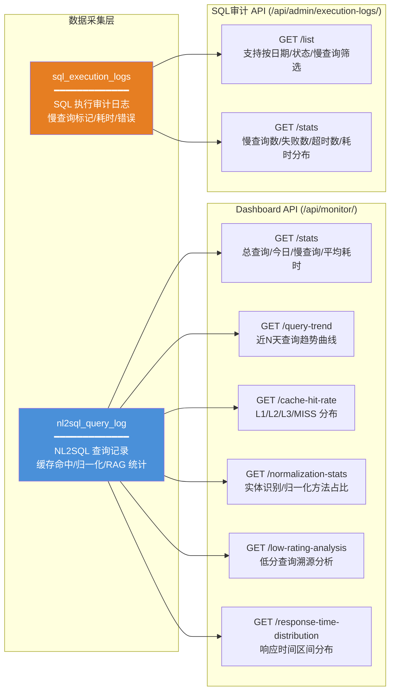

**监控 Dashboard 核心指标（`MonitorController`）：**

| API 端点 | 功能 | 数据来源 | 典型用途 |
|----------|------|---------|---------|
| `GET /api/monitor/stats` | 系统总览：总查询数、今日查询数、慢查询数（>3s）、平均耗时 | `nl2sql_query_log` | 首页 Dashboard 核心指标卡片 |
| `GET /api/monitor/query-trend?days=7` | 近 N 天查询趋势曲线（总量/成功量/缓存命中量） | `nl2sql_query_log` | ECharts 折线图：每日查询量走势 |
| `GET /api/monitor/cache-hit-rate` | 三级缓存命中率分布（L1/L2/L3/MISS）+ RAG 使用统计 | `nl2sql_query_log` | 饼图：缓存层级占比，评估缓存策略有效性 |
| `GET /api/monitor/normalization-stats` | 实体识别统计（人名/地名占比）、归一化方法分布 | `nl2sql_query_log` | 评估预处理管线效果 |
| `GET /api/monitor/response-time-distribution` | 响应时间区间分布（<1s / 1-2s / 2-3s / 3-5s / >5s） | `nl2sql_query_log` | 柱状图：识别长尾慢查询比例 |
| `GET /api/monitor/low-rating-analysis` | 低分查询详情列表（rating ≤ 2），关联反馈文本 | `nl2sql_query_log` + `rag_feedback` | 问题溯源：定位 Prompt/RAG/模型短板 |

**SQL 慢查询审计（`ExecutionLogController`）：**

| API 端点 | 功能 | 关键字段 |
|----------|------|---------|
| `GET /api/admin/execution-logs/list` | 按时间范围/状态/慢查询筛选执行日志 | `is_slow_query`, `execution_time_ms`, `error_message` |
| `GET /api/admin/execution-logs/stats` | 统计概览：总执行数/慢查询数/失败数/超时数/平均耗时/最大耗时 | `sql_execution_logs` |

**SQL 执行日志表结构（自动建表）：**

```sql
-- SQLExecutionLogService 启动时自动建表
CREATE TABLE sql_execution_logs (
    id            BIGINT PRIMARY KEY AUTO_INCREMENT,
    user_id       BIGINT,
    username      VARCHAR(50),
    sql_text      TEXT NOT NULL,           -- 执行的 SQL 原文
    execution_time_ms BIGINT,             -- 执行耗时(ms)
    row_count     INT,                     -- 返回行数
    is_slow_query TINYINT(1) DEFAULT 0,   -- 是否慢查询（> 3s）
    status        VARCHAR(20) DEFAULT 'SUCCESS',  -- SUCCESS / FAILED / TIMEOUT
    error_message TEXT,                    -- 错误信息
    ip_address    VARCHAR(50),            -- 来源 IP
    created_at    DATETIME DEFAULT CURRENT_TIMESTAMP
);
```

**设计亮点：**
- **零配置上线**：`sql_execution_logs` 表由 `SQLExecutionLogService.initTable()` 自动创建，无需手动执行 DDL
- **`nl2sql_query_log` vs `sql_execution_logs` 双表分工**：前者记录 NL2SQL 语义层指标（缓存/RAG/归一化），后者记录数据库层指标（慢查询/超时/错误），各司其职、互不耦合
- **ECharts 就绪**：`query-trend` / `response-time-distribution` 等接口直接返回前端图表所需的数据结构（`{dates, counts}` / `{ranges, counts}`），无需二次处理
- **MyBatis + JdbcTemplate 双降级**：`ExecutionLogMapper` 可用时走 MyBatis，不可用时自动降级 JdbcTemplate，保证日志写入的鲁棒性

关键实现：[MonitorController.java](file:///d:/WorkSpace/idea%20workspace/NL2Sql/nl2sql-web/src/main/java/com/nl2sql/web/controller/MonitorController.java) | [ExecutionLogController.java](file:///d:/WorkSpace/idea%20workspace/NL2Sql/nl2sql-web/src/main/java/com/nl2sql/web/controller/ExecutionLogController.java) | [SQLExecutionLogService.java](file:///d:/WorkSpace/idea%20workspace/NL2Sql/nl2sql-core/src/main/java/com/nl2sql/core/executor/SQLExecutionLogService.java) | [QueryMonitoringEventListener.java](file:///d:/WorkSpace/idea%20workspace/NL2Sql/nl2sql-core/src/main/java/com/nl2sql/core/event/QueryMonitoringEventListener.java)

---

## 📊 核心性能指标

基于 Plan-and-Execute 架构 + 三级缓存 + 模型路由的端到端性能数据（Ollama 本地部署，qwen2.5-coder:7b + qwen3:8b，16GB VRAM）：

| 查询场景 | L1 缓存命中 | L2 模板命中 | L3 向量命中 | 完整生成 | 说明 |
|---------|:----------:|:----------:|:----------:|:--------:|------|
| **简单单表查询**<br/>"查询昨天的订单数" | <1ms | ~5ms | ~50ms | ~800ms | Redis 精确匹配命中 >50% |
| **单表聚合查询**<br/>"各品类月度销售额统计" | <1ms | ~5ms | ~50ms | ~1.5s | 模板填充命中约 20% |
| **多表 JOIN 查询**<br/>"各地区销售额并按季度对比" | — | ~5ms | ~50ms | ~2.5s | 需 Schema 检索 + RAG 增强 |
| **复杂报表**<br/>"Top 10 商品增速 + 图表推荐 + AI 总结" | — | — | ~50ms | ~4s | PlannerAgent 规划 + 多 Worker 协作 |
| **SQL 纠错重试**<br/>首次生成失败 → 自动修复 | — | — | — | ~3s | ErrorClassifier + 最多 3 次自动修复 |

> **综合缓存命中率 >60%**，命中时响应延迟 <50ms（加权平均），完整链路 0.8s ~ 4s。

### 与业界方案的成本效率对比

| 指标 | DataMind AI（本地 Ollama） | 云端 API 方案（GPT-4o） | DataMind 优势 |
|------|:------------------------:|:---------------------:|:-----------:|
| **单次查询成本** | 0 元（本地推理） | ~$0.01-0.05 | 零成本 |
| **缓存命中查询** | 0 Token 消耗 | 无缓存机制 | 零 Token |
| **日均 1000 次查询** | 电费 $0.5-1/天 | ~$10-50/天 | 成本降低 90%+ |
| **数据隐私** | 完全本地化 | API 传输风险 | 企业级合规 |
| **峰值吞吐** | GPU 吞吐上限 | API 限流 | 可线性扩展 |

---

## 🆚 与主流 NL2SQL 框架对比

### 综合对比矩阵

| 维度 | **DataMind AI** | Vanna AI | WrenAI | SuperSonic | Chat2DB | SQLChat | spring-ai-alibaba-nl2sql |
|------|:---:|:---:|:---:|:---:|:---:|:---:|:---:|
| | ⭐ 本项目 | Python RAG 框架 | GenBI 上下文层 | Headless BI | 数据库工具 | AI SQL 助手 | 阿里云析言 GBI 开源版 |
| **开发语言** | **Java 21** | Python | Rust + Python | Java | Java | TypeScript | Java |
| **架构模式** | **Plan-and-Execute 多智能体** | ReAct / CoT | Semantic MDL | Semantic Layer | LLM + Rule | Agent | Agent + Schema Recall |
| **多智能体协作** | ✅ Supervisor+Planner+3 Workers | ❌ 单 Agent | ❌ | ❌ | ❌ | ❌ | ⚠️ 固定流程 |
| **复杂度自适应** | ✅ 三级评估(S/M/C) + 模型路由 | ❌ | ❌ | ❌ | ❌ | ❌ | ❌ |
| **工作流编排** | ✅ SKILL.md YAML 声明式 | ❌ 硬编码 | ⚠️ MDL 建模 | ❌ | ❌ | ❌ | ❌ |
| **三级缓存** | ✅ L1 Redis + L2 Template + L3 Chroma | ❌ | ❌ | ⚠️ 基础缓存 | ⚠️ 基础缓存 | ❌ | ❌ |
| **向量检索** | ✅ ChromaDB 双层(表+字段·1024维) | ✅ Chroma 单层 | ❌ | ❌ | ⚠️ 实验性 | ❌ | ✅ Schema 向量化 |
| **重排序 (Rerank)** | ✅ CrossEncoder + Jina 双方案 | ❌ | ❌ | ❌ | ❌ | ❌ | ❌ |
| **SQL Self-Correction** | ✅ 6 类错误 + 幻觉检测 | ⚠️ 基础重试 | ⚠️ 基础重试 | ❌ | ⚠️ 基础 | ⚠️ 基础 | ⚠️ 基础 |
| **安全防护** | ✅ 五层(JWT+表+列+AST+人工审批) | ❌ 无内置 | ⚠️ 基础 | ✅ 语义层 | ⚠️ 基础 | ⚠️ 基础 | ⚠️ 基础 |
| **人机协同** | ✅ 数据源澄清 + 高风险阻断审批 | ❌ | ❌ | ❌ | ❌ | ❌ | ❌ |
| **Prompt A/B 测试** | ✅ 版本管理 + 流量分流 + 自动决策 | ❌ | ❌ | ❌ | ❌ | ❌ | ❌ |
| **监控 Dashboard** | ✅ 内置 8 个 Dashboard API + SQL 审计 | ❌ | ❌ | ❌ | ❌ | ❌ | ❌ |
| **反馈学习闭环** | ✅ 低分分析 + 知识修正 + Prompt 优化 | ❌ | ❌ | ❌ | ❌ | ❌ | ❌ |
| **行业语义** | ✅ 5 大行业 + 可插拔扩展 | ❌ | ❌ | ⚠️ 语义模型 | ❌ | ❌ | ⚠️ 语义层 |
| **全链路追踪** | ✅ LangSmith + Langfuse 双平台 | ❌ | ❌ | ⚠️ 基础日志 | ❌ | ❌ | ❌ |
| **MCP 协议** | ✅ 7 个 MCP Tool | ❌ | ✅ Agent 技能 | ❌ | ❌ | ❌ | ❌ |
| **中文原生支持** | ✅ 中文优先 + bge-m3 中文优化 | ⚠️ 依赖 Prompt | ⚠️ 英文优先 | ✅ 中文优化 | ✅ 中文优化 | ⚠️ 依赖 Prompt | ✅ 中文优化 (通义) |
| **LLM 后端数量** | **8 种** (Ollama/vLLM/TGI/...) | ⚠️ 有限 | ⚠️ 有限 | ⚠️ 有限 | ⚠️ 有限 | ⚠️ 有限 | ⚠️ 有限 |
| **Docker 一键部署** | ✅ Compose + 多 Profile | ⚠️ 需自建 | ✅ | ✅ | ✅ | ⚠️ | ✅ |
| **数据完全私有化** | ✅ 全部本地部署 | ⚠️ 需云端 API | ✅ 可本地 | ✅ 可本地 | ✅ 可本地 | ⚠️ 需 API | ✅ 可本地 |
| **Web UI** | ✅ 22+ 页面管理后台 | ❌ Jupyter | ❌ CLI | ✅ | ✅ | ✅ | ✅ |
| **SSE 流式响应** | ✅ 实时流式对话 | ❌ | ❌ | ❌ | ❌ | ❌ | ❌ |
| **自动图表** | ✅ ECharts 自动检测+推荐 | ❌ | ❌ | ✅ | ❌ | ❌ | ❌ |
| **多数据源** | ✅ 动态 HikariCP 连接池 | ⚠️ 单连接 | ✅ 20+ | ✅ | ✅ | ⚠️ | ✅ |
| **动态 Prompt** | ✅ 模块化 × 7，Token 减少 60-70% | ❌ | ❌ | ❌ | ❌ | ❌ | ❌ |
| **Excel 导出** | ✅ 查询结果一键导出 | ❌ | ❌ | ✅ | ✅ | ❌ | ❌ |
| **监控 Dashboard** | ✅ 运维监控 + Skill 指标 | ❌ | ❌ | ❌ | ❌ | ❌ | ❌ |
| **会话管理** | ✅ 多轮对话 + 上下文记忆 | ❌ | ⚠️ | ❌ | ❌ | ✅ | ⚠️ |

### 差异化深度解读

#### 1. 架构先进性 — Plan-and-Execute vs 传统 ReAct

| 对比维度 | Plan-and-Execute (DataMind AI) | ReAct 循环 (大部分框架) |
|---------|:-------------------------------:|:---------------------------:|
| **决策质量** | Planner 提前规划完整路径，避免"走一步看一步" | 逐步推理，容易走偏 |
| **幻觉控制** | 结构化 QueryPlan 约束执行边界 | 长上下文容易产生幻觉 |
| **可调试性** | 每步可独立追踪、可独立测试 | 黑盒循环，难以定位问题 |
| **组件复用** | 各组件独立，可单独升级或替换 | 强耦合 |
| **并行能力** | 支持子步骤并行执行 | 串行循环 |

#### 2. 缓存体系 — 三级 vs 单级/无缓存

DataMind AI 的独创三级缓存架构实现了**分级命中、逐级降级**，综合命中率 >60%：
- **L1 Redis** 精确匹配，响应 <1ms，适合高频重复查询
- **L2 模板填充** 参数化复用，适合结构相似、参数不同的查询
- **L3 ChromaDB** 语义匹配，适合语义相似但表达不同的查询

其他框架大多没有缓存或仅有基础的 Redis 缓存，无法覆盖"语义相似但表达不同"的场景。

#### 3. 检索精度 — 三层精排 vs 单层检索

```
DataMind AI 三层精排:
  初排 (bge-m3 向量) → 精排 (CrossEncoder Reranker) → 校验 (Jaccard 相似度)
  
业界常见:
  初排 (向量) → 直接使用结果
```

重排序机制是 DataMind AI 的独特优势，目前主流开源 NL2SQL 框架几乎都没有实现检索结果的精排。

#### 4. 自我进化 — 反馈闭环 vs 静态规则

大部分 NL2SQL 框架是静态的——配置好规则后，系统表现不会随时间推移而改善。DataMind AI 实现了完整的反馈学习闭环：

- **正向学习**：高评分 SQL 自动入库，丰富知识库
- **负向学习**：低评分自动触发分析，修正知识权重
- **Prompt 进化**：根据历史反馈自动优化 Prompt 模板

#### 5. 可观测性 — 三层互补 vs 基础日志

DataMind AI 实现了三层互补的可观测体系，远超业界平均水平：

| 观测层 | DataMind AI | 业界常见 |
|--------|:-----------:|:--------:|
| **外部追踪** | LangSmith + Langfuse 双平台、Run 树结构、Token 统计 | 基础日志 |
| **AOP 度量** | SkillMetricsAspect 自动拦截、PerformanceMonitor 实时统计 | 无或手动埋点 |
| **事件驱动日志** | Spring Event + @Async 异步、非阻塞持久化 | 同步日志写入 |

#### 6. 安全防护 — 五层纵深防御 vs 基础认证

DataMind AI 的五层安全体系从认证到执行实现全链路防护，将安全前置到 SQL 生成阶段而非仅在执行时才拦截：

```
JWT 认证 → 表级权限 → 列级脱敏 → SQL AST 校验 → 高风险人工审批
    ↑                          ↑                        ↑
  拦截未授权用户             拦截危险 SQL            高风险仍需确认
```

#### 7. 人机协同 — 人工兜底 vs 盲目决策

当 AI 遇到不确定性时，DataMind AI 不会强行猜测，而是将决策权交还用户——这是目前所有主流开源 NL2SQL 框架中**独有的人机协同能力**：

| 协同节点 | 触发条件 | 交互方式 | 与其他框架对比 |
|---------|---------|---------|:---:|
| **数据源选择** | LLM 匹配置信度 < 80% | 展示数据源列表，用户手动选择 | 其他框架要么预设、要么报错 |
| **表名确认** | 多轮表发现仍找不到目标表 | 生成澄清问题，用户确认 | 其他框架直接返回错误 |
| **高风险阻断** | SQL 风险等级 = HIGH | 返回审批请求（含 SQL 预览+优化建议），用户决策 | 其他框架要么拦截不告知、要么直接拒绝 |

#### 8. 成本效率 — 全本地 vs 云端 API

由于 DataMind AI 支持全本地部署（Ollama + ChromaDB + bge-m3），配合三级缓存体系：
- 日均 1000 查询仅需电费 $0.5-1 vs 云端 API $10-50
- 缓存命中时零 Token 消耗，进一步降低边际成本
- 数据不出私有网络，满足金融/医疗等合规要求

### 功能覆盖度雷达图

| 能力维度 | DataMind AI | Vanna AI | WrenAI | SuperSonic | Chat2DB |
|:-------:|:-----------:|:--------:|:------:|:----------:|:-------:|
| **智能体架构** | ★★★★★ | ★★★ | ★★ | ★★ | ★★ |
| **缓存体系** | ★★★★★ | ★ | ★ | ★★★ | ★★★ |
| **检索精度** | ★★★★★ | ★★★★ | ★ | ★ | ★★ |
| **SQL 纠错** | ★★★★★ | ★★★ | ★★ | ★ | ★★ |
| **安全防护** | ★★★★★ | ★ | ★★ | ★★★★ | ★★★ |
| **自我进化** | ★★★★★ | ★ | ★ | ★ | ★ |
| **可观测性** | ★★★★★ | ★★ | ★★ | ★★★ | ★★ |
| **人机协同** | ★★★★★ | ★ | ★ | ★ | ★ |
| **Prompt A/B 测试** | ★★★★★ | ★ | ★ | ★ | ★ |
| **监控 Dashboard** | ★★★★★ | ★★ | ★★ | ★★ | ★★ |
| **中文支持** | ★★★★★ | ★★ | ★ | ★★★★ | ★★★★ |
| **部署便利** | ★★★★ | ★★★ | ★★★★ | ★★★ | ★★★★★ |
| **私有化程度** | ★★★★★ | ★★ | ★★★★ | ★★★★ | ★★★ |


## 🚀 快速开始

### 环境要求

| 依赖 | 版本 | 说明 |
|------|------|------|
| JDK | 21+ | **强制使用路径**: `D:\Program Files\Java\jdk-21.0.6` |
| MySQL | 8.0+ | 存储元数据与业务数据 |
| Redis | 6.x+ | 分布式缓存与会话管理 |
| Ollama | 最新 | 推荐模型: qwen2.5-coder:7b + qwen3:8b（也可用阿里云 API 替代） |
| ChromaDB | 可选 | 语义缓存与 RAG 知识库 |
| Docker | 可选 | 容器化一键部署 |

### 3 分钟本地启动

**Step 1: 初始化数据库**

```bash
mysql -u root -p < init_complete_database.sql
```

**Step 2: 配置 LLM**

编辑 `nl2sql-web/src/main/resources/application.yml`，选择 LLM 后端：

```yaml
# 方案 A：使用本地 Ollama（推荐开发环境，零成本）
llm:
  active-provider: ollama
  ollama:
    enabled: true
    code-model: qwen2.5-coder:7b-instruct-q4_0
    nlp-model: qwen3:8b
    embedding-model: bge-m3

# 方案 B：使用阿里云百炼 API（推荐生产环境）
# llm:
#   active-provider: aliyun
#   aliyun:
#     enabled: true
#     model: qwen-plus
#     api-key: ${ALIYUN_API_KEY}
```

**Step 3: 编译运行**

```bash
cd "D:\WorkSpace\idea workspace\NL2Sql"
mvn clean package -DskipTests
java -jar nl2sql-web/target/nl2sql-web-1.0.0.jar
```

**Step 4: 访问系统**

打开浏览器访问: **http://localhost:8080**

默认账号: `admin` / `admin123`

### Docker 一键部署

```bash
cd docker
# 启动全部服务（含 GPU 推理服务）
docker-compose --profile full up -d
# 仅启动基础服务（不含 GPU）
docker-compose up -d
```

支持 Profile 分离部署：
- `docker-compose up -d` — 仅基础服务（MySQL + Redis + 应用）
- `docker-compose --profile gpu up -d` — 基础服务 + GPU 服务（Ollama + TEI Reranker）
- `docker-compose --profile full up -d` — 全部服务

详细说明见 [docker/README.md](file:///d:/WorkSpace/idea%20workspace/NL2Sql/docker/README.md)

---

## 📊 典型查询流程

以"统计上个月各地区的订单总额"为例，完整链路耗时 **1-3 秒**：

```
用户: "统计上个月各地区的订单总额"
  │
  ├─ [0ms] SupervisorAgent 接收请求
  │     └─ IntentClassifier: 意图 = QUERY (置信度 0.95)
  │     └─ SkillRouter: 路由 → execute_standard_query
  │
  ├─ [2ms] 缓存检查 (L1 Redis → L2 Template → L3 ChromaDB)
  │     └─ 未命中，继续执行
  │
  ├─ [10ms] PlannerAgent 生成 QueryPlan
  │     └─ 复杂度: SIMPLE（单表聚合，无需规划，直接执行）
  │
  ├─ [50ms] WorkflowEngine 执行 Skill 工作流
  │     ├─ Step 1: 参数校验 (validateParams)
  │     │     └─ datasourceId ✅, question ✅
  │     ├─ Step 2: 图表意图检测 (detectAndGenerateChart)
  │     │     └─ 条件分支：有图表意图 → 检测图表类型
  │     ├─ Step 3: Schema 检索 (retrieveSchema)
  │     │     ├─ SynonymService: "总额" → "金额/销售额"
  │     │     ├─ ChromaDB 双层向量检索: orders, regions 表
  │     │     └─ MetadataService: 加载表结构与关联关系
  │     ├─ Step 4: SQL 生成 (generateSQL)
  │     │     ├─ ModelRouterService: SIMPLE → Code 模型
  │     │     ├─ RagEnhancerTool: Top-3 相似历史 SQL 注入
  │     │     ├─ CrossEncoderReranker: 精排检索结果
  │     │     ├─ IndustryConceptInjector: "总额" → SUM(actual_amount)
  │     │     └─ 生成: SELECT r.name, SUM(o.actual_amount) ...
  │     ├─ Step 5: SQL 校验 (validateSQL)
  │     │     ├─ SQLSecurityValidator: 安全规则检查 ✅
  │     │     ├─ ColumnPermissionService: 列级脱敏检查 ✅
  │     │     └─ 风险评估: LOW（WHERE + LIMIT 通过）
  │     ├─ Step 6: 人机协同判断 (checkHumanApproval)
  │     │     └─ 风险 LOW，无需人工审核，继续执行
  │     └─ Step 7: SQL 执行 (executeSQL)
  │           ├─ HikariCP 连接池获取连接
  │           ├─ ExecuteSafeSQLTool 安全执行
  │           ├─ 执行查询 → 返回 15 行数据
  │           └─ SQLAutoRatingService: 自动评分 4 星
  │
  ├─ [200ms] 结果组装 + 缓存写入
  │     ├─ 写入 L1 Redis 缓存 (TTL 30min)
  │     ├─ 自动评分 >= 3 星，触发 RagAutoLearner 入库
  │     └─ 上报 LangSmith Trace（Run 树结构）
  │
  └─ [~250ms] 返回最终结果
        ├─ data: [{"region": "华东", "total": 128500}, ...]
        ├─ sql: "SELECT r.name, SUM(o.actual_amount) ..."
        ├─ executionTime: "250ms"
        ├─ chartSuggestion: "饼图适合展示地区占比"
        └─ followUpSuggestions: ["AI 总结", "导出 Excel"]
```

---

## 🧩 项目模块结构

```
NL2Sql/
├── nl2sql-common/             # 通用工具模块
│   └── util/                  # 加密、JSON、字符串、模板等工具类
├── nl2sql-core/               # 核心业务模块 ⭐ (系统心脏)
│   ├── agent/                 # Plan-and-Execute 多智能体架构
│   │   ├── SupervisorAgent.java           # 总指挥：意图分类 + 路由分发
│   │   ├── PlannerAgent.java              # 规划器：QueryPlan 生成
│   │   ├── NL2SQLAgent.java               # LangChain4j AiService 接口
│   │   ├── ReActAgent.java                # [@Deprecated] 旧 ReAct 实现
│   │   ├── engine/                        # WorkflowEngine 工作流引擎
│   │   │   ├── WorkflowEngine.java        # 核心引擎（纯 Java）
│   │   │   ├── WorkflowLoader.java        # SKILL.md 加载与解析
│   │   │   ├── WorkflowStepExecutor.java  # 步骤执行器
│   │   │   ├── WorkflowExpressionResolver # 变量解析（{{variable}}）
│   │   │   └── WorkflowTracingHelper.java # 追踪辅助
│   │   ├── tools/                         # 49 个原子 Tool 实现
│   │   │   ├── SchemaRetrieverTool.java   # 表结构检索
│   │   │   ├── SQLGeneratorTool.java      # SQL 生成
│   │   │   ├── SQLAutoFixTool.java        # SQL 自动修复
│   │   │   ├── RagEnhancerTool.java       # RAG 历史 SQL 注入
│   │   │   ├── ChartDetectionTool.java    # 图表意图检测
│   │   │   ├── IterativeTableDiscoveryTool # 迭代式表发现
│   │   │   ├── IndustryConceptInjectorTool # 行业概念注入
│   │   │   ├── ... (41 more)
│   │   │   └── ToolRegistry.java          # Tool 自动注册中心
│   │   ├── worker/                        # 专用 Worker (Sql/Chart/Summary)
│   │   ├── prompt/                        # 动态 Prompt 模块化构建 (7 模块)
│   │   ├── intent/                        # IntentClassifier 意图识别
│   │   ├── routing/                       # SkillRouter 技能路由
│   │   ├── monitoring/                    # AOP 技能监控
│   │   │   ├── SkillMetricsAspect.java    # AOP 切面（自动拦截）
│   │   │   └── SkillMetricsRecorder.java  # 指标记录器
│   │   ├── skills/                        # Skill 元数据加载
│   │   ├── extension/                     # 语义映射扩展 (电商/金融)
│   │   └── validation/                    # SQL 校验服务
│   ├── cache/                 # 三级缓存 (Redis + 模板 + ChromaDB)
│   │   ├── QueryCacheService.java         # L1 Redis 精确匹配
│   │   ├── QueryResultCache.java          # Redis 结果缓存
│   │   ├── SQLTemplateCache.java          # L2 模板匹配
│   │   ├── SQLTemplateFiller.java         # 模板参数填充
│   │   ├── QueryCacheVectorService.java   # L3 ChromaDB 语义检索
│   │   ├── QueryStructureExtractor.java   # 查询结构提取
│   │   └── IndustryTargetExtractor.java   # 行业参数提取
│   ├── rag/                   # RAG 检索引擎
│   │   ├── ChromaVectorService.java       # ChromaDB 向量存储
│   │   ├── MySqlVectorService.java        # MySQL 降级
│   │   ├── FeedbackLearningService.java   # 反馈学习（核心闭环）
│   │   ├── RagAutoLearner.java            # 自动学习入库
│   │   ├── PromptLearningService.java     # Prompt 学习
│   │   ├── SQLAutoRatingService.java      # SQL 自动评分
│   │   └── LowRatingExampleService.java   # 低分示例过滤
│   ├── rerank/                # 重排序 (CrossEncoder + Jina)
│   │   ├── CrossEncoderReranker.java      # bge-reranker-v2-m3
│   │   ├── JinaReranker.java              # Jina AI API
│   │   └── RerankerConfig.java            # 自动配置与降级
│   ├── llm/                   # LLM 服务层
│   │   ├── ModelRouterService.java        # 复杂度自适应路由
│   │   ├── LLMService.java                # LLM 调用封装
│   │   ├── MultiModelService.java         # 多模型管理
│   │   ├── SynonymService.java            # 同义词服务
│   │   ├── LocationSemanticService.java   # 地理位置语义
│   │   ├── IndustryConceptDictionary.java # 行业概念词典 (5 行业)
│   │   ├── provider/                      # 8 种 LLM 后端适配
│   │   └── extension/                     # 行业概念四层扩展
│   ├── tracing/               # 可观测性
│   │   ├── LangSmithTracingService.java   # LangSmith 追踪
│   │   ├── LangfuseTracingService.java    # Langfuse 追踪
│   │   └── TracingConfig.java             # 追踪配置
│   ├── observability/         # 执行追踪
│   │   ├── ExecutionTracer.java           # 执行链路追踪
│   │   └── ExecutionTrace.java            # 追踪记录模型
│   ├── monitor/               # 性能监控
│   │   └── PerformanceMonitor.java        # Tool 级 P95 耗时与成功率
│   ├── event/                 # 事件驱动监控
│   │   ├── QueryMonitoringEvent.java      # 查询监控事件
│   │   └── QueryMonitoringEventListener.java # 异步事件处理
│   ├── error/                 # 错误分类器 (6 种错误类型)
│   │   ├── ErrorClassifier.java           # 正则模式匹配
│   │   └── RetryableExecutor.java         # 可配置重试
│   ├── executor/              # SQL 执行与风险分析
│   │   ├── SQLExecutor.java               # SQL 执行器
│   │   ├── SQLRiskAnalyzer.java           # 风险分析器
│   │   ├── ExcelExportService.java        # Excel 导出
│   │   └── PaginationService.java         # 分页服务
│   ├── datasource/            # 动态数据源管理 (HikariCP)
│   ├── metadata/              # 元数据管理
│   └── service/               # 核心服务层
│       ├── MonitoringContext.java         # 监控上下文 (ThreadLocal)
│       └── ...
├── nl2sql-security/           # 安全模块
│   ├── SQLSecurityValidator.java          # SQL AST 安全校验 (JSqlParser)
│   └── ColumnPermissionService.java       # 列级权限控制
├── nl2sql-conversation/       # 对话模块 (多轮对话、会话管理)
│   ├── ConversationService.java           # 会话管理
│   └── ConversationHistoryService.java    # 对话历史
├── nl2sql-audit/              # 审计模块 (查询日志、操作记录)
│   └── AuditService.java                 # 审计服务
├── nl2sql-mcp/                # MCP Server (7 个 MCP Tool)
│   └── tool/
│       ├── QuerySchemaTool.java           # 查询 Schema
│       ├── GenerateSqlTool.java           # 生成 SQL
│       ├── ExecuteSqlTool.java            # 执行 SQL
│       ├── ValidateSqlTool.java           # 校验 SQL
│       ├── ListDatasourcesTool.java       # 列出数据源
│       ├── GetTableRelationshipsTool.java # 获取表关联
│       └── AddDatasourceTool.java         # 添加数据源
├── nl2sql-web/                # Web 层
│   ├── controller/            # 19 个 REST API 控制器
│   ├── config/                # Spring Boot 配置 (JWT/Redis/WebMvc)
│   ├── security/              # API Key 认证
│   ├── service/               # Web 层服务 (AgentChat/StreamChat)
│   ├── filter/                # 过滤器 (Auth/Logging)
│   └── resources/
│       ├── skills/            # 6 个 SKILL.md 工作流定义
│       └── static/            # 22+ 前端页面 (agent-chat, stream-chat, admin...)
└── docker/                    # Docker 部署
    ├── docker-compose.yml     # 多 Profile 服务编排
    ├── Dockerfile             # 多阶段构建 (Maven + JRE)
    ├── .env                   # 环境变量配置
    └── mysql/init/            # 数据库初始化脚本
```

---

## 🔌 可扩展性设计

### LLM 提供者扩展

实现 `LLMProvider` 接口即可接入新的 LLM 后端，`LLMProviderManager` 自动发现和管理：

```java
// llm/provider/LLMProvider.java
public interface LLMProvider {
    String getName();
    boolean isAvailable();
    String generate(String prompt, double temperature);
    String generateJson(String systemPrompt, String userPrompt, double temperature);
    default Map<String, Object> generateWithTools(...) { ... }
    default void generateStream(...) { ... }
    default List<float[]> embed(List<String> texts) { ... }
}
```

已支持的 8 种后端：Ollama / vLLM / TGI / TensorRT-LLM / llama.cpp / ChatGLM / Qwen / 阿里云通义千问

### 行业概念扩展

实现 `IndustryConceptExtension` 接口，提供四层扩展能力：

```java
// llm/extension/IndustryConceptExtension.java
public interface IndustryConceptExtension {
    // Level 1: 术语理解增强 — 识别行业专有名词
    List<Map<String, Object>> extractTerms(String question, Long datasourceId);
    
    // Level 2: SQL 生成干预 — 在 LLM 生成前注入行业规则
    String enhancePromptBeforeGeneration(...);
    String correctSqlAfterGeneration(...);
    
    // Level 3: 语义一致性校验 — 确保生成结果符合业务逻辑
    boolean validateSemanticConsistency(...);
    
    // Level 4: 持续学习优化 — 根据执行反馈自我改进
    void learnFromExecution(...);
}
```

### Skill 扩展

在 `nl2sql-web/src/main/resources/skills/` 目录下创建新目录和 `SKILL.md` 文件即可定义新的工作流，系统通过 `SkillsMetadataLoader` 自动扫描加载，无需编写 Java 代码。

### MCP 工具扩展

系统内置 MCP Server 模块（`nl2sql-mcp`），对外暴露 7 个标准化 MCP Tool，可被任何支持 MCP 协议的 AI 客户端（如 Claude Desktop、Cursor、Windsurf）直接调用：

```
MCP Client (Claude Desktop / Cursor)
  │
  ├─ QuerySchema        → 查询数据库 Schema 及元数据
  ├─ GenerateSql        → 根据自然语言生成 SQL
  ├─ ExecuteSql         → 安全执行 SQL（含权限校验）
  ├─ ValidateSql        → 校验 SQL 语法与安全性
  ├─ ListDatasources    → 列出可用数据源
  ├─ GetTableRelationships → 获取表关联关系
  └─ AddDatasource      → 动态添加数据源
```

MCP Server 基于 `spring-ai-starter-mcp-server` 构建，Spring Boot 自动装配，开箱即用。

---

## 🗺️ Roadmap

### 近期规划 (1-3 个月) — 正在开发中

- [ ] **SQL 执行沙箱** — 事务回滚 + 只读副本环境预览 SQL 执行结果，确认后再写入主库
- [ ] **多数据源联邦查询** — 跨 MySQL / PostgreSQL / ClickHouse 的跨源 JOIN 查询
- [ ] **前端现代化重构** — Vue 3 + TypeScript + Vite 替换当前 HTML/CSS 静态页面
- [ ] **Prometheus + Grafana 集成** — 利用现有 PerformanceMonitor 指标数据，接入统一监控大盘
- [ ] **Milvus 向量数据库支持** — 作为 ChromaDB 的替代方案，适用于大规模向量检索场景

### 中期规划 (3-6 个月) — 设计阶段

- [ ] **查询结果可视化 Dashboard** — 图表自动推荐增强 + 多图表联动 + 下钻分析
- [ ] **多租户隔离架构** — 企业级多租户方案，数据完全隔离，独立配置
- [ ] **查询优化建议引擎** — 基于历史慢查询，自动推荐索引优化和 SQL 改写
- [ ] **自助数据源接入** — 管理后台自助配置 MySQL/PostgreSQL 数据源，无需重启
- [ ] **Elasticsearch 向量检索支持** — 支持 ES 作为向量存储后端，利用现有 ES 集群

### 长期愿景 (6-12 个月) — 规划中

- [ ] **自动化异常检测** — 定时扫描数据，检测异常趋势并通过企业微信/钉钉推送告警
- [ ] **知识图谱增强** — 基于图数据库存储实体关系，提升复杂关联查询的语义理解能力
- [ ] **Sub-Agent 架构演进** — 参考 [SUB_AGENT_ROADMAP.md](file:///d:/WorkSpace/idea%20workspace/NL2Sql/SUB_AGENT_ROADMAP.md)，演进为 Master Agent + 6 个专用 Sub-Agent 协作模式

---

## 📄 技术栈总览

| 层级 | 技术 | 版本 | 用途 |
|------|------|------|------|
| **语言** | Java | 21 | 核心开发语言 |
| **框架** | Spring Boot | 3.2.5 | 应用框架 |
| **AI 框架** | LangChain4j | 1.12.2 | LLM 应用编排 |
| **关系数据库** | MySQL | 8.0 | 元数据 + 业务数据存储 |
| **缓存** | Redis | 6.x | 三级缓存 L1 + 会话管理 |
| **向量数据库** | ChromaDB | latest | 向量检索 + RAG 知识库 |
| **LLM 服务** | Ollama / 阿里云百炼 | latest | 本地/云端模型推理 |
| **模型部署** | vLLM / TGI / TensorRT-LLM | latest | 高性能模型推理（可选） |
| **嵌入模型** | bge-m3 | 1024维 | 中英文嵌入向量 |
| **重排序模型** | bge-reranker-v2-m3 | 1024维 | Cross-Encoder 精排 |
| **安全分析** | JSqlParser | latest | SQL AST 解析与校验 |
| **链路追踪** | LangSmith / Langfuse | latest | 全链路可观测 |
| **性能监控** | Spring AOP + Event | — | AOP 切面 + 事件驱动监控 |
| **容器** | Docker + Docker Compose | latest | 一键部署 |
| **MCP 协议** | Spring AI MCP Server | latest | AI 工具生态互操作 |
| **前端** | HTML/CSS + ECharts | - | 查询界面 + 管理后台 |
| **API 文档** | Swagger / OpenAPI | - | REST API 自动文档 |

---

## 📄 许可证

本项目采用 MIT 许可证。详见 [LICENSE](LICENSE) 文件。

---

## 🙏 致谢

DataMind AI 的构建离不开以下优秀的开源项目：

- [LangChain4j](https://github.com/langchain4j/langchain4j) — Java LLM 应用开发框架
- [Spring Boot](https://spring.io/projects/spring-boot) — 企业级应用框架
- [ChromaDB](https://www.trychroma.com/) — 开源向量数据库
- [Ollama](https://ollama.com/) — 本地 LLM 推理引擎
- [JSqlParser](https://github.com/JSQLParser/JSqlParser) — SQL 语法解析器
- [bge-m3](https://huggingface.co/BAAI/bge-m3) — 中英文嵌入模型
- [bge-reranker-v2-m3](https://huggingface.co/BAAI/bge-reranker-v2-m3) — Cross-Encoder 精排模型
- [ECharts](https://echarts.apache.org/) — 数据可视化图表库

---

<div align="center">

<br/>

**DataMind AI** — 让数据查询像对话一样简单，让分析洞察像计划一样严谨

⭐ 如果这个项目对你有帮助，欢迎 Star 支持！

Made with ❤️ by the DataMind AI Team

</div>