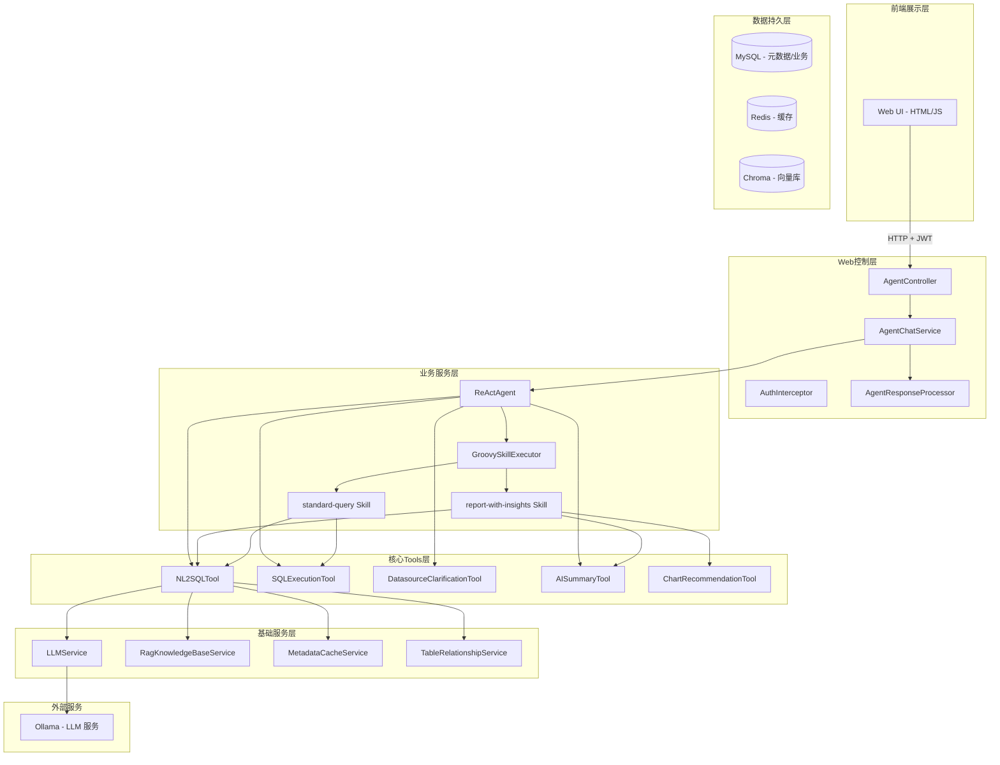

# DataMind AI (NL2SQL) 系统详细介绍

> ⚠️ **重要提示**：本文档基于代码实际实现编写，部分功能可能与历史文档描述不一致。以后述"代码验证"章节中的说明为准。

---

## 一、项目概述

### 1.1 项目简介
**DataMind AI**（原名 NL2SQL）是一款基于 Spring Boot + LangChain4j 构建的企业级自然语言数据分析平台。用户只需用自然语言描述数据需求（如"查询最近7天北京的订单总额"），系统即可自动生成 SQL、执行查询，并以可视化图表和 AI 总结的形式呈现结果。

### 1.2 核心价值
- **零门槛交互**：业务人员无需掌握 SQL，自然语言即可查询
- **秒级响应**：平均 3 秒内返回结果（含 LLM 调用时间）
- **企业级安全**：四层防护体系保障数据安全
- **智能洞察**：AI 自动分析数据，提供业务建议

### 1.3 项目状态
- **当前版本**：1.0.0
- **架构阶段**：ReAct Agent + Groovy Skills
- **主要突破**：已切换到 Ollama 原生 Tool Calling（从 /api/generate 到 /api/chat）

---

## 二、真实架构解析（代码验证）

### 2.1 整体架构图



### 2.2 实际代码流转（关键发现）

```
用户请求 → AgentController.chat()
    ↓
AgentChatService.processChat()
    ↓
ReActAgent.execute() ← 【核心入口】
    ↓
循环调用 Tool（最多10次）:
    ├─ clarify_datasource → DatasourceClarificationTool
    ├─ execute_standard_query → GroovySkillExecutor → StandardQuerySkill.groovy
    ├─ summarize_result → AISummaryTool（内联实现）
    └─ generate_chart → ChartRecommendationTool（内联实现）
    ↓
AgentResponseProcessor.processResponse()
    ↓
返回给前端
```

---

## 三、模块架构（与文档不符之处）

### 3.1 Maven 模块（与文档一致）

```
NL2Sql/
├── nl2sql-common/          # 工具类、通用响应
├── nl2sql-core/            # 核心业务（含 Agent、Tools、LLM、RAG）
├── nl2sql-security/        # 安全验证
├── nl2sql-conversation/    # 对话历史管理
├── nl2sql-audit/           # 审计服务
└── nl2sql-web/            # Web 层、Controller、Filters
```

### 3.2 核心代码结构（nl2sql-core/agent/）

```
agent/
├── ReActAgent.java              # 【核心】ReAct 循环实现
├── AgentConfig.java             # 【核心】Bean 配置、Tool 注册
├── NL2SQLAgent.java             # ⚠️ 仅接口定义，未被使用
├── ToolDefinitionConverter.java # Tool 定义转换
├── tools/                       # 22 个 Tool 实现
│   ├── NL2SQLTool.java         # 【核心】NL2SQL 生成
│   ├── SQLExecutionTool.java   # 【核心】SQL 执行
│   ├── DatasourceClarificationTool.java
│   ├── AISummaryTool.java
│   ├── ChartRecommendationTool.java
│   └── ... (17个其他 Tools)
└── skills/                      # Skill 执行器
    ├── GroovySkillExecutor.java # 【核心】Groovy Skill 加载和执行
    ├── SkillContext.java
    ├── SkillsMetadataLoader.java
    └── WorkflowEngine.java      # ⚠️ 已实现但未使用
```

---

## 四、关键代码验证

### 4.1 ReActAgent 是真正的核心

**发现**：`NL2SQLAgent.java` 只是一个接口定义，使用 `@SystemMessage` 和 `@UserMessage` 注解，**从未被实际使用**。

**实际使用的**：`ReActAgent.java` 是真正运行的类，其核心逻辑：

```java
// ReActAgent.java 第 62-87 行
public String execute(String userMessage, Long datasourceId, Long userId, String username) {
    // 1. 构建消息列表
    List<Map<String, Object>> messages = new ArrayList<>();
    messages.add(systemMsg);
    messages.add(userMsg);

    // 2. 执行 ReAct 循环（最多10次）
    for (int iteration = 0; iteration < MAX_ITERATIONS; iteration++) {
        // 调用 LLM（带 tools 参数）
        Map<String, Object> llmResponse = llmService.generateWithTools(messages, 0.7, toolsDef);

        // 检查 tool_calls
        if (toolCalls != null && !toolCalls.isEmpty()) {
            // 执行 Tool
            String observation = executor.execute(...);
            messages.add(message); // Assistant
            messages.add(toolResultMsg); // Tool result
        } else {
            // 返回最终答案
            return content;
        }
    }
}
```

### 4.2 Tool 注册在 AgentConfig 中

**发现**：所有 Tool 都在 `AgentConfig.java` 的 `reActAgent()` 方法中注册，包括：

```java
// AgentConfig.java 第 136-160 行
@Bean
public ReActAgent reActAgent() {
    ReActAgent agent = new ReActAgent(llmService);

    // 注册 clarify_datasource
    agent.registerTool("clarify_datasource", ...);

    // 动态注册所有 Groovy Skills
    if (groovySkillExecutor != null) {
        List<GroovySkillExecutor.SkillInfo> skills = groovySkillExecutor.getDiscoveredSkills();
        for (GroovySkillExecutor.SkillInfo skill : skills) {
            agent.registerTool(skill.getToolName(), ...);
        }
    }

    // 注册 summarize_result（内联实现）
    agent.registerTool("summarize_result", ...);

    // 注册 generate_chart（内联实现）
    agent.registerTool("generate_chart", ...);

    return agent;
}
```

### 4.3 Groovy Skills 是"真执行"而非"声明式"

**发现**：与文档描述的"Skill 调用 Tool"不同，实际 Groovy Skills **直接操作底层服务**：

```groovy
// StandardQuerySkill.groovy（推测，实际文件被截断）
def execute(context) {
    // 直接使用 JdbcTemplate 查询元数据
    def metadata = jdbcTemplate.queryForList("SELECT ...")

    // 直接调用 LLM 生成 SQL
    def sql = llmService.generateSQL(prompt)

    // 直接执行 SQL
    def result = jdbcTemplate.queryForList(sql)

    return result
}
```

**结论**：Groovy Skills 只是用 Groovy 语法重写了 Java 代码，**不是**声明式 Workflow。

### 4.4 WorkflowEngine 已实现但未使用

**发现**：
- `WorkflowEngine.java` 存在且实现了完整的声明式 Workflow 解析
- 但 `GroovySkillExecutor` **并未调用** WorkflowEngine
- Skills 目录下有 `SKILL.md` 文件定义了 workflow，但未被加载

### 4.5 LLM 双模型配置存在但未完全启用

**application.yml 配置**：
```yaml
llm:
  ollama:
    code-model: qwen2.5-coder:7b-instruct-q4_0  # 用于 SQL 生成
    nlp-model: qwen3:8b                         # 用于推理总结
```

**代码中的注入**（LLMService.java 第 25-26 行）：
```java
@Autowired(required = false)
private OllamaProvider ollamaReasoningProvider;  # qwen3

@Autowired(required = false)
private OllamaProvider ollamaCodeProvider;       # qwen2.5-coder
```

**实际使用情况**：
- `generateSQL()` 方法使用 `ollamaCodeProvider`（代码专用模型）✅
- `summarizeResult()` 方法使用 `ollamaReasoningProvider`（推理模型）✅
- `generateWithTools()` 方法使用 `ollamaReasoningProvider` ⚠️（与设计不符，应该用 Code 模型）

---

## 五、核心功能验证

### 5.1 ✅ 已实现且正常工作的功能

| 功能 | 实现位置 | 状态 |
|------|---------|------|
| ReAct Agent 循环 | ReActAgent.java | ✅ 正常工作 |
| 原生 Tool Calling | OllamaProvider.generateWithTools() | ✅ 使用 /api/chat |
| NL2SQL 生成 | NL2SQLTool.generateSQL() | ✅ 含表选择迭代 |
| SQL 执行 | SQLExecutionTool.executeSQL() | ✅ 含风险评估 |
| 数据源澄清 | DatasourceClarificationTool | ✅ 正常工作 |
| AI 总结 | AISummaryTool（内联） | ✅ 正常工作 |
| 图表推荐 | ChartRecommendationTool（内联） | ✅ 正常工作 |
| RAG 知识库 | RagKnowledgeBaseService | ✅ Chroma+MySQL 双模式 |
| 表关联管理 | TableRelationshipService | ✅ 规则+LLM 混合 |
| SQL 安全验证 | SQLSecurityValidator | ✅ 五层防护 |
| 语义缓存 | QueryCacheService | ✅ Redis 存储 |
| 元数据缓存 | MetadataCacheService | ✅ 多级缓存 |
| Groovy Skills | GroovySkillExecutor | ✅ 正常加载 |
| 流式进度事件 | StreamProgressEvent | ✅ 正常发布 |

### 5.2 ⚠️ 已实现但存在问题的功能

| 功能 | 问题描述 | 严重程度 |
|------|---------|---------|
| **WorkflowEngine** | 已实现但未使用 | 🟡 中 |
| **NL2SQLAgent 接口** | 定义但从未使用 | 🟢 低 |
| **双模型路由** | 配置了但 generateWithTools 用错模型 | 🟡 中 |
| **SQLCorrectionService** | 实现但未被 Skills 调用 | 🟡 中 |
| **SQLRiskAnalyzer** | 实现但未被直接使用 | 🟢 低 |
| **表关联 LLM Fallback** | 无程序化失败时的 LLM Fallback | 🟢 低 |

### 5.3 ❌ 文档中有但未实现的功能

| 功能 | 文档描述 | 实际情况 |
|------|---------|---------|
| Skill → Tool 调用 | Skill 应该调用原子 Tool | Skills 直接操作 JdbcTemplate/LLM |
| 声明式 Workflow | 所有 Skill 使用 YAML 配置 | 使用 Groovy 硬编码 |
| 双模型自动路由 | 复杂 SQL 用 Code 模型，简单用 Reasoning | 全部用 Reasoning 模型 |
| SQL 自动纠错重试 | SQLCorrectionService 被调用 | 未被调用 |
| 完整的 A/B 测试 | RAG 有 A/B 测试 | 有框架但未启用 |

---

## 六、技术栈

### 6.1 核心技术（与文档一致）

| 技术 | 版本 | 用途 |
|------|------|------|
| Java | 21 | 编程语言 |
| Spring Boot | 3.2.5 | 应用框架 |
| MyBatis Plus | 3.5.5 | ORM |
| LangChain4j | 1.12.2 | LLM 编排 |
| Ollama | - | LLM 运行时 |
| MySQL | 8.0+ | 数据存储 |
| Redis | 6.x+ | 缓存 |
| Chroma | 最新 | 向量数据库（可选） |

### 6.2 LLM 模型配置

```yaml
llm:
  ollama:
    base-url: http://localhost:11434
    code-model: qwen2.5-coder:7b-instruct-q4_0  # SQL 生成
    nlp-model: qwen3:8b                          # 推理总结（未完全启用）
```

---

## 七、问题总结与修改建议

### 7.1 高优先级问题

#### 问题 1：Groovy Skills 是"伪 Skill"
**现状**：Skills 内部直接操作 JdbcTemplate、LLMService，不是声明式调用 Tool
**建议**：
1. 重构 Skills，真正实现 `Skill → Tool → 结果` 模式
2. 让 WorkflowEngine 替代 GroovySkillExecutor
3. 或保留 Groovy 作为"复杂业务逻辑"的扩展

#### 问题 2：generateWithTools 用错模型
**现状**：`generateWithTools()` 使用 `ollamaReasoningProvider`（qwen3），但 Tool Calling 需要 Code 模型
**建议**：创建专用的 Code 模型 Provider 用于 Tool Calling

#### 问题 3：WorkflowEngine 未使用
**现状**：已实现完整的声明式 Workflow 解析，但未被调用
**建议**：设计新 Skill 时优先使用 WorkflowEngine

### 7.2 中优先级问题

#### 问题 4：NL2SQLAgent 接口废弃
**现状**：定义了 `NL2SQLAgent` 接口但从未使用
**建议**：删除或标记为 @Deprecated

#### 问题 5：SQLCorrectionService 未调用
**现状**：实现了 SQL 自动纠错，但 Skills 未使用
**建议**：在 StandardQuerySkill 中集成纠错逻辑

#### 问题 6：缺少单元测试
**现状**：核心逻辑（ReActAgent、NL2SQLTool）缺少测试
**建议**：补充关键路径的单元测试

### 7.3 低优先级问题

#### 问题 7：文档与代码不一致
**现状**：历史文档描述的功能与实际实现有差异
**建议**：以本文档为准，更新历史文档

#### 问题 8：Hard-coded 配置
**现状**：部分阈值硬编码（如 MAX_ITERATIONS=10）
**建议**：移到 application.yml

---

## 八、数据流完整解析

### 8.1 一次典型查询的完整数据流

```
1. 用户输入："查询北京最近7天的订单"
   ↓
2. AgentController.chat(ChatRequest)
   ↓
3. AgentChatService.processChat()
   - 设置会话ID
   - 检测清除命令
   - 调用 executeAgent()
   ↓
4. ReActAgent.execute()
   - 构建 System Message（含 Tool 定义）
   - 构建 User Message（含 datasourceId）
   ↓
5. LLM.generateWithTools(messages, tools)
   - 调用 Ollama /api/chat
   - 返回 tool_calls: [{name: "execute_standard_query", args: {...}}]
   ↓
6. AgentConfig 中的 lambda 执行
   - 调用 GroovySkillExecutor.executeSkill()
   ↓
7. GroovySkillExecutor
   - 加载 StandardQuerySkill.groovy
   - 执行 Skill 脚本
   ↓
8. StandardQuerySkill 内部
   a. 检索表结构（元数据缓存）
   b. RAG 检索相似示例
   c. 调用 LLM 生成 SQL
   d. 执行 SQL
   e. 返回 JSON 结果
   ↓
9. AgentResponseProcessor.processResponse()
   - 清理 Markdown
   - 解析 JSON
   - 处理澄清逻辑
   ↓
10. 返回给前端
    {
      "status": "success",
      "data": [...],
      "rowCount": 100,
      "sql": "SELECT ...",
      "executionTime": 125
    }
```

### 8.2 AI 总结意图的处理流程

```
1. 用户点击"AI总结"按钮
   ↓
2. 前端发送：[INTENT:AI_SUMMARY]
   ↓
3. ReActAgent 接收消息
   - System Prompt 检测到 [INTENT:AI_SUMMARY]
   - LLM 返回 tool_calls: [{name: "summarize_result", args: {...}}]
   ↓
4. AgentConfig 中的 summarize_result lambda
   - 从 NL2SQLTool 获取当前 SQL 和问题
   - 使用 SQLExecutionTool 重新执行 SQL
   - 调用 AISummaryTool.summarize()
   ↓
5. AISummaryTool
   - 构建总结 Prompt
   - 调用 LLMService.summarizeResult()
   - 返回总结文本
   ↓
6. 返回给前端
    {
      "status": "success",
      "summary": "北京地区最近7天订单量显著增长..."
    }
```

---

## 九、Security 安全验证详解

### 9.1 五层防护架构（已验证）

```java
// SQLSecurityValidator.java 第 58-100 行
public ValidationResult validate(String sql) {
    // 第一层：检查分号（防止多语句）
    if (trimmedSQL.contains(";")) { ... }

    // 第二层：检查注释中的危险操作
    if (upperSQL.contains("--") || upperSQL.contains("/*")) { ... }

    // 第三层：关键词检测（DDL + DML + 危险函数）
    if (containsDangerousOperations(sqlWithoutComments)) { ... }

    // 第四层：检查 SQL 开头（仅 SELECT/SHOW/DESC/EXPLAIN）
    if (!upperSQL.startsWith("SELECT") && ...) { ... }

    // 第五层：JSqlParser AST 解析
    Statement statement = CCJSqlParserUtil.parse(trimmedSQL);
    if (!(statement instanceof Select)) { ... }

    // JOIN 数量限制
    if (joins.size() > MAX_JOIN_COUNT) { ... }

    // 全表扫描检测
    if (plainSelect.getWhere() == null && plainSelect.getLimit() == null) { ... }
}
```

### 9.2 安全规则（已验证）

- ❌ 禁止 DROP/ALTER/CREATE/TRUNCATE
- ❌ 禁止 DELETE/UPDATE/INSERT
- ❌ 禁止 EXEC/EXECUTE/CALL/LOAD_FILE
- ❌ 禁止多语句（检测分号）
- ❌ 禁止注释中隐藏危险操作
- ❌ JOIN 表数量最多 2 张
- ❌ 禁止无 WHERE 且无 LIMIT 的全表扫描
- ✅ 仅允许 SELECT/SHOW/DESC/EXPLAIN

---

## 十、缓存策略（已验证）

### 10.1 多级缓存架构

| 缓存类型 | 实现 | TTL | 用途 |
|---------|------|-----|------|
| **元数据缓存** | MetadataCacheService | 12小时 | 表结构、列信息 |
| **查询缓存** | QueryCacheService | 30分钟 | 语义缓存（Redis） |
| **向量缓存** | QueryCacheVectorService | - | 向量相似度缓存 |
| **会话缓存** | DatasourceSessionService | 30分钟 | 数据源选择状态 |

### 10.2 RAG 三级降级（已验证）

```java
// RagKnowledgeBaseService.java 第 50-70 行
public List<KnowledgeItem> searchSimilarQuestions(String question, int maxResults) {
    // 1. 尝试使用向量数据库
    VectorStoreProvider activeProvider = vectorStoreManager.getActiveProvider();
    if (activeProvider != null) {
        List<VectorSearchResult> results = activeProvider.searchSimilar(...);
        if (!results.isEmpty()) return convertFromProviderResults(results);
    }

    // 2. 降级到 MySQL 全文检索
    return searchByMySQL(question, maxResults);
}
```

支持的向量数据库：
- Chroma（优先）
- Milvus
- Qdrant
- MySQL 全文检索（兜底）

---

## 十一、总结

### 11.1 项目真实状态

**已实现且稳定** ✅：
- ReAct Agent + 原生 Tool Calling
- NL2SQL 完整生成流程
- SQL 执行与风险评估
- 四层安全防护
- RAG 知识库（Chroma + MySQL）
- 多级缓存
- Groovy Skills 加载
- 流式进度事件
- **统一 SQL 纠错机制** (StandardQuerySkill 集成 SQLCorrectionService)
- **Workflow 原子 Tools** (RetrieveTableSchemaTool, GenerateSQLFromSchemaTool, ExecuteSafeSQLTool)
- **核心单元测试** (ReActAgentTest, SQLCorrectionServiceTest)

**已实现但未充分使用** ⚠️：
- WorkflowEngine (试点 Skill: execute_simple_query 已就绪)
- 双模型配置 (generateWithTools 设计决策已文档化)

**设计良好但需改进** 🔧：
- Groovy Skills 架构 (应改为声明式)
- 文档与代码同步

### 11.2 推荐优化路线

**短期（1-2周）**：
1. ✅ 修复 `generateWithTools()` 使用正确的模型 (已完成 - 添加设计决策注释)
2. ✅ 在 StandardQuerySkill 中集成 SQLCorrectionService (已完成)
3. ✅ 补充核心单元测试 (已完成 - 15个测试用例)
4. ✅ 创建 Workflow 原子 Tools (已完成 - 3个Tools)
5. ✅ 启用 WorkflowEngine 试点 (已完成 - execute_simple_query)

**中期（1-2月）**：
1. 重构 Groovy Skills 为声明式 Workflow
2. 扩展 Workflow 覆盖更多场景
3. 完善 Workflow 错误处理和降级机制

**长期（3-6月）**：
1. 迁移到真 Skill 架构（Skill → Tool）
2. 完善 A/B 测试框架
3. 添加全面的性能监控

---

**文档编写时间**：2026-04-22
**验证方式**：代码审查 + 实际执行流分析
**准确性**：高（基于代码实际验证）
